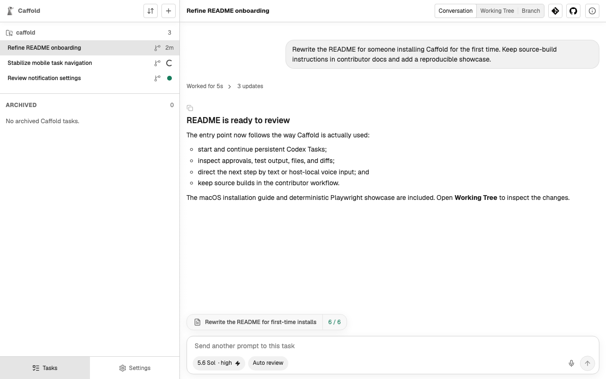
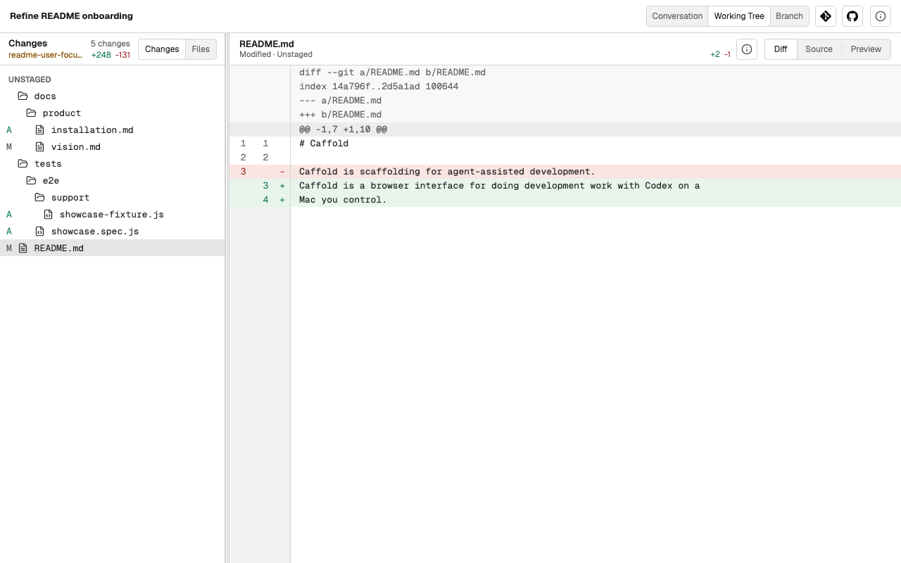

# Caffold

Caffold is a self-hosted workspace for running and reviewing coding-agent work
from any screen. Keep Codex or Claude Code working on a Mac you control, then
follow the conversation, answer approvals, inspect commands and tests, and read
the actual files and diff from a desktop, foldable, tablet, or phone.

The layout adapts to the screen; the workflow stays the same. A Task still
contains one agent conversation and the repository context needed to judge its
work. Start on one device, leave the turn running on the Mac, and return from
another to decide what happens next by text or voice.

Caffold is not a hosted agent, remote terminal, or replacement harness. The
agent CLIs, repositories, credentials, conversations, and execution remain on
your Mac.

## What it looks like



_Follow a Task as it runs, then read the result and decide what comes next._



_Open Working Tree to review the actual files and diff without leaving the
Task._

_These deterministic showcase images use a Codex Task. Claude Tasks use the
same Conversation and review workspace._

## One workspace, native agents

When you create a Task, choosing a model also chooses the agent that provides
it. Caffold currently supports:

- **Codex**, through its persistent app-server runtime; and
- **Claude Code**, through its CLI protocol and a Caffold runner that keeps the
  CLI process attached while the backend is replaced.

A Task remains bound to that agent for its lifetime. Its model, reasoning or
effort choices, permission modes, tools, session behavior, and transcript come
from the selected agent rather than from a Caffold reimplementation.

This is deliberate. A coding agent is the model together with the harness its
authors built around it. Caffold gives Codex and Claude separate native drivers
so it can preserve those harnesses instead of forcing both through a lowest
common denominator. It normalizes only the product concepts the workspace must
present consistently: conversations, turns, activity, approvals, and the
operations a Task can actually perform.

See [Agent runtimes](docs/architecture/agent-runtimes.md) for the design and the
different state, transport, and recovery boundaries of the two integrations.

## How it works

Only one machine does the actual work. Install `Caffold Server.app` on the Mac
that has the agent CLIs, Git, and your checkouts. The app stays in the menu bar,
keeps the Caffold backend available, and connects the browser interface to the
selected agent and the files on that Mac.

```text
browser or installed PWA
(desktop, foldable, tablet, phone)
              |
     local URL or private
     Tailscale HTTPS URL
              |
     Caffold Server on Mac
        /            \
 Codex app-server   Claude runner -> claude CLI
        \            /
       Git checkouts and worktrees
```

On the host Mac, `Open Caffold` opens the local address. On another device,
Tailscale Serve can provide a private HTTPS address. Configure and copy that
address from **Settings → Remote Access**; the ready page also provides a QR
code for another permitted device.

Each browser or installed PWA is a window onto the same Mac, not another copy
of the server. Closing it does not end a turn, but the Mac must stay awake,
running Caffold, and reachable for remote use.

## A typical Task

1. Start a Task in the directory where the work belongs and choose a Codex or
   Claude model.
2. Follow the conversation and answer the agent's approval requests while it
   works.
3. Read the result, command and test output, changed files, and actual diff.
4. Type or dictate the next instruction, steer an active turn, or return later
   and continue the same Task.

For longer turns, each browser can opt in to system notifications under
**Settings → Notifications**, for a turn that ends and for a Task waiting on an
approval.

Caffold also keeps the Task connected to its repository, optional managed
worktree, Git history, and read-only GitHub Issue or Pull Request context.

## Install on macOS

Caffold supports Apple silicon Macs running macOS 14 or later. Install and sign
in to at least one supported agent:

- the official standalone Codex CLI `0.147.0` or newer; or
- Claude Code `2.1.236` or newer, available as `claude` on the app's `PATH`.

Both may be installed, and Caffold will offer the models it can reach. The
[installation guide](docs/product/installation.md) has the agent-specific
setup and diagnostics.

Install Caffold with Homebrew:

```sh
brew install --cask panarch/tap/caffold
```

Launch `Caffold Server` from Applications, then choose `Open Caffold` from its
menu-bar menu.

## Work without a keyboard

The Task composer supports host-local multilingual voice input. On first use,
Caffold asks before downloading the pinned Whisper `large-v3-turbo` model
(about 1.5 GiB). Audio is sent only to the same Caffold host, processed in
memory, and never stored or sent to an external speech service.

Voice is useful here for the same reason the browser interface is useful: much
of the work is giving direction, reading what happened, and following up. A
keyboard is welcome, but it should not be required for every step.

## Current limits

Caffold assumes one trusted user, one trusted Mac, and a private network. It
does not provide authentication for a public deployment or multi-user
authorization.

Agent support is built in rather than loaded as a runtime plugin. Caffold
currently drives Codex and Claude Code; it does not provide an ACP driver or
let an existing Task switch agents.

Its Git and GitHub views are deliberately review-oriented. Caffold does not
provide a full editor or terminal, and it does not expose stage, commit,
checkout, merge, rebase, reset, stash, publication, or review mutation
controls. Those operations can still be requested through the Task's agent or
performed with the developer tools you already use.

Managed-worktree preparation is explicit, and Caffold only cleans up worktrees
that it created and recorded. The complete implemented scope and limitations
are tracked in [Current Product Status](docs/product/status.md).

## Documentation and development

- [Installation and operation](docs/product/installation.md)
- [Product vision](docs/product/vision.md)
- [Current product status](docs/product/status.md)
- [Product workflows](docs/product/workflows.md)
- [Agent runtime architecture](docs/architecture/agent-runtimes.md)
- [Roadmap](docs/product/roadmap.md)
- [Contributing](CONTRIBUTING.md)
- [Testing](docs/development/testing.md)

The complete [documentation index](docs/README.md) groups product,
architecture, development, review, and maintainer material by purpose. Caffold
is available under the [Apache License 2.0](LICENSE).
