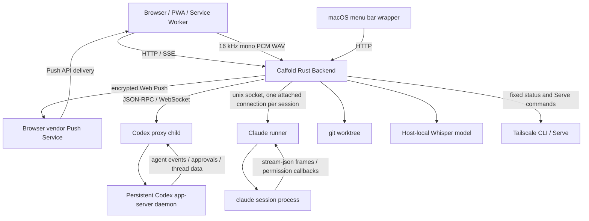

# Architecture

This document describes Caffold's current architecture. It is not a
compatibility contract.

Caffold is organized around one control instance per trusted host.

That instance serves the UI, drives the agents a Task can belong to, talks to the local filesystem and git, and exposes task/review APIs to the browser.



## Components

### PWA

The PWA is the primary and most complete review and control surface. It should
be usable from desktop and mobile browsers. It does not own the source of
truth.

### macOS Wrapper

The macOS menu bar wrapper is a native host launcher, status surface, and
compact control surface. The PWA being primary does not make it the exclusive
client of Caffold capabilities. A setting or action may remain available in
Swift after it gains a browser surface, provided both clients consume the same
backend-owned state and mutation contract.

The non-duplication boundary applies to product logic, not to useful entry
points or presentation. Swift and the PWA may both expose the same setting or
action; they must not separately infer its state, persist competing values, or
implement different operational semantics. Platform failures before the
backend is available, macOS application lifecycle, and native launch behavior
remain wrapper-owned.

### Rust Backend

The backend owns:

- host instance lifecycle
- live file, git, and worktree-context lookup
- Codex app-server daemon connection and disposable proxy lifecycle
- Claude runner supervision and one attached session per Claude Task
- JSON-RPC adapter
- git status, diff, log, and file APIs
- host-local Whisper model installation, verification, and transcription
- canonical Tailscale status classification, private URL derivation,
  constrained Caffold Serve operations, and SVG QR encoding limited to a
  canonical private Tailnet URL
- browser Push subscription persistence and isolated outbound delivery
- shared server-backed product settings and capability APIs consumed by
  browser and platform clients
- PWA asset serving

The application layer is split by the state and transport boundary it owns:

```text
caffold/src/app.rs                     dependency construction and router composition
caffold/src/app/error.rs               shared JSON HTTP error contract
caffold/src/app/shell.rs               shell, health, settings, manifest, static assets
caffold/src/app/workspace.rs           Files, images, watches, Git, and GitHub HTTP adapters
caffold/src/app/tasks.rs               private Tasks state assembly and runtime shutdown
caffold/src/app/tasks/routes.rs        Tasks/Codex HTTP DTOs, validation, handlers, REST/SSE routes
caffold/src/app/tasks/push.rs          Push subscription HTTP API, persistence adapter, and delivery runtime
caffold/src/app/tasks/detail.rs        canonical task detail, session, history, and sync application
caffold/src/app/tasks/runtime.rs       runtime composition, per-Task agent routing, cross-role orchestration
caffold/src/app/tasks/runtime/
  process.rs                           readiness, connection, generation, restart, and shutdown
  bridge.rs                            app-server event bridging and managed session recovery
  claude_bridge.rs                     Claude session reports and approvals routed into the Task application
  server_requests.rs                   approvals and Caffold-owned dynamic tool requests
caffold/src/agent.rs                   the agents Caffold drives and the vocabulary they report in
caffold/src/agent/driver.rs            which agent is being asked, and the questions that are the same for all
caffold/src/agent/codex.rs             Codex app-server transport, protocol, readiness, and contract
caffold/src/agent/claude.rs            Claude sessions, their control protocol, and their contract
caffold/src/agent/claude/
  protocol.rs                          the stream-json and control wire types
  translate.rs                         one translator from Claude content blocks to Caffold items
  transcript.rs                        reading a conversation back from the file the agent writes
  runner.rs                            reaching the runner, and the stand-in a test drives instead
caffold/src/app/tasks/sync.rs          rollout invalidation scheduling and retry timing
caffold/src/app/tasks/projection.rs    pure thread/turn to browser task projection
caffold/src/app/tasks/events.rs        event normalization, merge, cache, and publication
caffold/src/app/voice.rs               model lifecycle, WAV validation, and local transcription
caffold/src/app/tailscale.rs           Tailscale HTTP routes, service orchestration, and fixed Serve control
caffold/src/app/tailscale/status.rs    canonical status model, Serve classification, and private URL validation
caffold/src/app/tailscale/cli.rs       bounded Tailscale CLI discovery and process execution
```

`caffold/src/app.rs` does not own feature state. It constructs the Shell,
Workspace, Tasks, Voice, and Tailscale applications and merges their completed
routers. Each HTTP owner keeps its route state and DTOs private. Tasks lower
modules receive only the capabilities they use; they do not depend on Axum
extractors or the full Tasks route state. Within Tasks, Projection and Events
are the stateless or bounded-memory base, Runtime owns app-server transport,
Sync owns scheduling, Detail applies canonical reads, and Routes adapts those
owners to HTTP.

### Codex App Server

Codex app-server owns Codex thread, turn, approval, and event stream behavior.
Caffold treats it as an external integration boundary and does not embed Codex
internal crates.

### Claude Runner

Claude ships no daemon, so Caffold runs one: `caffold-claude-runner`, a
workspace member that holds `claude` child processes and relays their frames
without reading them. It listens on a unix socket beside the database, so an
installed application and a development server drive their own. One session per
Claude Task, reached on one attached connection; the runner refuses a second
client for the same session rather than splitting its output.

The runner is deliberately ignorant. It does not know which argument selects a
model or enables the permission callback, and it keeps no history. It outlives
the backend, which is what lets a turn survive a restart, and it is given its
own process group so a signal to Caffold does not take it along.

### Git Worktree

The worktree is the source of truth for code changes. Caffold reads from git and file contents to present review surfaces.

### Voice Input

The shared task composer captures microphone samples with an AudioWorklet and
creates a bounded 16 kHz mono 16-bit PCM WAV in the browser. It sends that WAV
over the existing same-origin Caffold connection. The backend validates and
decodes it in memory, lazily loads the pinned multilingual Whisper `large-v3-turbo`
model, serializes inference, and returns text for insertion at the selection
saved when recording began. It never stores raw recordings or calls an external
speech-to-text service. The model remains loaded for the backend process
lifetime; Tailscale is transport for remote browsers, not part of inference.

## Source of Truth

- Codex thread/session: conversation, turns, agent activity
- Claude session: conversation, turns, agent activity, and the transcript the
  agent writes for itself
- Caffold Redb: managed-thread membership, stable Active navigator names and
  Section placement, observed recency, persistent Web Push subscriptions and
  the stable server VAPID keypair, Task composer/seen state, each Section's
  composer selection from its last successfully started turn, and
  Caffold-managed worktree ownership and recovery
- git worktree: actual file and code changes
- Tailscale CLI and Serve configuration: live connection, mapping, and private
  Tailnet address state
- browser/PWA: presentation and controller state, plus the browser-owned Web
  Push subscription and local installation identity

## Process Model

The current model is one persistent Codex app-server daemon per user. A Caffold
backend ensures that daemon is running and connects through a proxy child that
may be replaced independently. Caffold owns and stops the proxy, not the daemon.

Claude has the same shape one level down: one runner per data directory, started
by the backend if it is not already listening, and one `claude` process per
Claude Task the runner holds. Caffold starts the runner and does not stop it,
because it is what carries a running turn across a backend restart. A Claude
session is held for as long as it lives rather than released when the last
viewer leaves — detaching and re-attaching costs a process, where dropping a
Codex subscription costs nothing.

Codex remains the source of truth for thread content and runtime state. Caffold
keeps local Caffold-owned tables for managed membership, the stable Active
navigator projection, and managed worktree ownership/recovery. Managed-thread
metadata includes the display name, nullable Section placement, observed
recency, Caffold timestamps, optional model/reasoning settings, and which agent
runs the Task. It does not store preview, agent timestamps, status, active turn,
transcript, or event summary.

A Claude Task also stores its working directory, because nothing else can answer
for it: a Claude session is a process, resuming one starts a new process, and
that process works wherever it is started, and the conversation the agent writes
down is filed under the directory the session was created in. Codex holds a
thread's working directory and answers for it, so a Codex Task stores none.

A Claude conversation is read from that file rather than from anything Caffold
keeps, so a Task the backend has forgotten comes back whole. Every session runs
with `--replay-user-messages`, which hands a prompt back under the identity the
agent filed it as; that identity names the turn, and it is the same identity the
file uses, so a turn watched live and the same turn read from disk are one turn
rather than two. What a running session knows is laid over the top, because only
it can say a turn is still running or that a refusal was a refusal. Active list identity and placement come directly from this local
projection; runtime state arrives independently after Codex connects. Caffold
derives repository and worktree presentation live from each thread cwd or
persisted logical Section path and does not keep a project registry. Tasks
globally groups the main checkout and linked worktrees by their shared Git
repository while each Task keeps its actual worktree root for Integrated
Review, Git, and GitHub context.

An eligible managed Task can explicitly move the same Codex thread into a new
Caffold-managed worktree. The ownership record permits bounded recovery,
archive removal, and restore only for paths Caffold created and verified. An
external worktree may be used as cwd but is never adopted or removed from path
inference alone.
