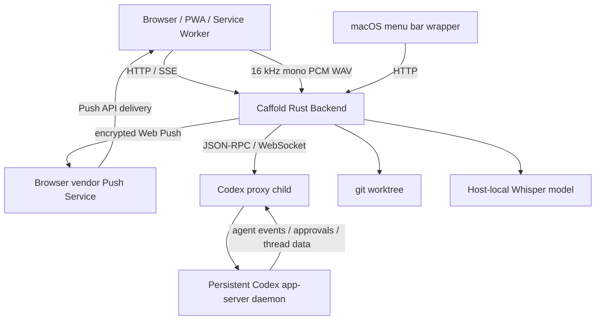

# Architecture

This document describes Caffold's current architecture. It is not a
compatibility contract.

Caffold is organized around one control instance per trusted host.

That instance serves the UI, manages Codex app-server, talks to the local filesystem and git, and exposes task/review APIs to the browser.



## Components

### PWA

The PWA is the primary and most complete review and control surface. It should
be usable from desktop and mobile browsers. It does not own the source of
truth.

### macOS Wrapper

The macOS menu bar wrapper is a native host launcher, status surface, and
compact control surface. The PWA being primary does not make it the exclusive
client of Caffold capabilities. A setting or action may remain available in
Swift after it gains a browser surface, provided both clients consume the same
backend-owned state and mutation contract.

The non-duplication boundary applies to product logic, not to useful entry
points or presentation. Swift and the PWA may both expose the same setting or
action; they must not separately infer its state, persist competing values, or
implement different operational semantics. Platform failures before the
backend is available, macOS application lifecycle, and native launch behavior
remain wrapper-owned.

### Rust Backend

The backend owns:

- host instance lifecycle
- live file, git, and worktree-context lookup
- Codex app-server daemon connection and disposable proxy lifecycle
- JSON-RPC adapter
- git status, diff, log, and file APIs
- host-local Whisper model installation, verification, and transcription
- browser Push subscription persistence and isolated outbound delivery
- shared server-backed product settings and capability APIs consumed by
  browser and platform clients
- PWA asset serving

The application layer is split by the state and transport boundary it owns:

```text
src/app.rs                     dependency construction and router composition
src/app/error.rs               shared JSON HTTP error contract
src/app/shell.rs               shell, health, settings, manifest, static assets
src/app/workspace.rs           Files, images, watches, Git, and GitHub HTTP adapters
src/app/tasks.rs               private Tasks state assembly and runtime shutdown
src/app/tasks/routes.rs        Tasks/Codex HTTP DTOs, validation, handlers, REST/SSE routes
src/app/tasks/push.rs          Push subscription HTTP API, persistence adapter, and delivery runtime
src/app/tasks/detail.rs        canonical task detail, session, history, and sync application
src/app/tasks/runtime.rs       Codex runtime composition and cross-role orchestration
src/app/tasks/runtime/
  process.rs                   readiness, connection, generation, restart, and shutdown
  bridge.rs                    app-server event bridging and managed session recovery
  server_requests.rs           approvals and Caffold-owned dynamic tool requests
src/app/tasks/sync.rs          rollout invalidation scheduling and retry timing
src/app/tasks/projection.rs    pure thread/turn to browser task projection
src/app/tasks/events.rs        event normalization, merge, cache, and publication
src/app/voice.rs               model lifecycle, WAV validation, and local transcription
```

`src/app.rs` does not own feature state. It constructs the Shell, Workspace, and
Tasks applications and merges their completed routers. Each HTTP owner keeps
its route state and DTOs private. Tasks lower modules receive only the
capabilities they use; they do not depend on Axum extractors or the full Tasks
route state. Within Tasks, Projection and Events are the stateless or
bounded-memory base, Runtime owns app-server transport, Sync owns scheduling,
Detail applies canonical reads, and Routes adapts those owners to HTTP.

### Codex App Server

Codex app-server owns Codex thread, turn, approval, and event stream behavior.
Caffold treats it as an external integration boundary and does not embed Codex
internal crates.

### Git Worktree

The worktree is the source of truth for code changes. Caffold reads from git and file contents to present review surfaces.

### Voice Input

The shared task composer captures microphone samples with an AudioWorklet and
creates a bounded 16 kHz mono 16-bit PCM WAV in the browser. It sends that WAV
over the existing same-origin Caffold connection. The backend validates and
decodes it in memory, lazily loads the pinned multilingual Whisper `large-v3-turbo`
model, serializes inference, and returns text for insertion at the selection
saved when recording began. It never stores raw recordings or calls an external
speech-to-text service. The model remains loaded for the backend process
lifetime; Tailscale is transport for remote browsers, not part of inference.

## Source of Truth

- Codex thread/session: conversation, turns, agent activity
- Caffold Redb: managed-thread membership, stable Active navigator names and
  Section placement, observed recency, persistent Web Push subscriptions and
  the stable server VAPID keypair, Task composer/seen state, each Section's
  composer selection from its last successfully started turn, and
  Caffold-managed worktree ownership and recovery
- git worktree: actual file and code changes
- browser/PWA: presentation and controller state, plus the browser-owned Web
  Push subscription and local installation identity

## Process Model

The current model is one persistent Codex app-server daemon per user. A Caffold
backend ensures that daemon is running and connects through a proxy child that
may be replaced independently. Caffold owns and stops the proxy, not the daemon.

Codex remains the source of truth for thread content and runtime state. Caffold
keeps local Caffold-owned tables for managed membership, the stable Active
navigator projection, and managed worktree ownership/recovery. Managed-thread
metadata includes the display name, nullable Section placement, observed
recency, Caffold timestamps, and optional model/reasoning settings. It does not
store preview, cwd, Codex timestamps, status, active turn, transcript, or event
summary. Active list identity and placement come directly from this local
projection; runtime state arrives independently after Codex connects. Caffold
derives repository and worktree presentation live from each thread cwd or
persisted logical Section path and does not keep a project registry. Tasks
globally groups the main checkout and linked worktrees by their shared Git
repository while each Task keeps its actual worktree root for Integrated
Review, Git, and GitHub context.

An eligible managed Task can explicitly move the same Codex thread into a new
Caffold-managed worktree. The ownership record permits bounded recovery,
archive removal, and restore only for paths Caffold created and verified. An
external worktree may be used as cwd but is never adopted or removed from path
inference alone.
