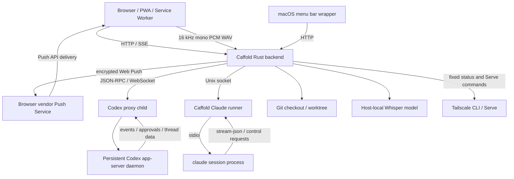

# Architecture

This document maps Caffold's current components and ownership boundaries. It is
not a compatibility contract.

Caffold runs one control instance per trusted host. That instance serves the
UI, drives the native agent selected for each Task, reads the local filesystem
and Git, and exposes Task and review APIs to the browser.



## Components

### Browser and PWA

The PWA is the primary and most complete review and control surface. It is
usable from desktop and mobile browsers and owns presentation, selection, and
request state rather than durable product or agent state.

### macOS wrapper

The menu-bar wrapper starts and controls the local backend, reports compact
host status, and participates in application update and recovery. The PWA and
Swift wrapper may expose the same backend-owned setting or action, but they
must not separately infer its state or implement different mutation semantics.
Platform failures before the backend is available, macOS lifecycle, and native
launch behavior remain wrapper-owned.

### Rust backend

The backend owns:

- host instance and HTTP/SSE lifecycle;
- Task membership, routing, and per-Task agent selection;
- the Codex proxy connection and Claude runner supervision;
- translation from each agent into Caffold's conversation, event, approval,
  and failure vocabulary;
- live file, Git, GitHub, and managed-worktree operations;
- host-local Whisper model installation, verification, and transcription;
- canonical Tailscale status, constrained Serve operations, and private URL/QR
  derivation;
- browser Push subscription persistence and delivery; and
- shared server settings, PWA assets, and capabilities consumed by browser and
  platform clients.

It does not own either agent's model harness or transcript. The architecture
and rationale for that boundary belongs to
[Agent Runtimes](agent-runtimes.md).

### Agent runtimes

A Task is bound to either Codex or Claude. Codex app-server owns Codex thread,
turn, approval, cwd, and event behavior. Claude Code owns its transcript,
stream-json/control behavior, tools, and permission model. Caffold's Claude
runner supplies process survival and frame relay without parsing the agent
protocol.

The shared Task application works only in Caffold's small product vocabulary.
Provider wire methods and payloads stop in the driver. See
[Codex App Server](codex-app-server.md) and
[caffold-claude-runner](../../runners/claude/README.md) for the provider and
transport details.

### Git checkout and worktree

Git is the source of truth for code changes. Caffold derives repository and
worktree context live and presents review surfaces from Git and file contents.
It may create and later remove only worktrees recorded under its managed
ownership contract.

### Voice input

The shared Task composer captures a bounded 16 kHz mono 16-bit PCM WAV and sends
it over the existing same-origin Caffold connection. The backend validates and
decodes it in memory, lazily loads the pinned multilingual Whisper
`large-v3-turbo` model, serializes inference, and returns text for insertion at
the saved selection. It never stores recordings or calls an external
speech-to-text service.

## Application ownership

The backend application is split by state and transport owner:

```text
caffold/src/app.rs                     dependency construction and router composition
caffold/src/app/error.rs               shared JSON HTTP error contract
caffold/src/app/shell.rs               shell, health, settings, manifest, static assets
caffold/src/app/workspace.rs           Files, images, watches, Git, and GitHub adapters
caffold/src/app/tasks.rs               private Tasks state and runtime shutdown
caffold/src/app/tasks/routes.rs        Task/agent HTTP DTOs, handlers, REST/SSE routes
caffold/src/app/tasks/detail.rs        canonical Task detail and history application
caffold/src/app/tasks/sessions.rs      ephemeral viewer, revision, and live-session state
caffold/src/app/tasks/runtime.rs       per-Task driver routing and orchestration
caffold/src/app/tasks/runtime/
  process.rs                           Codex readiness, connection, generation, restart
  bridge.rs                            Codex event bridge and managed-session recovery
  claude_bridge.rs                     Claude reports, approvals, and served-tool routing
  server_requests.rs                   Codex approvals and dynamic-tool requests
caffold/src/app/tasks/sync.rs          invalidation scheduling and retry timing
caffold/src/app/tasks/projection.rs    pure conversation-to-browser Task projection
caffold/src/app/tasks/events.rs        event normalization, merge, cache, publication
caffold/src/agent.rs                   shared agent vocabulary
caffold/src/agent/driver.rs            closed driver choice and shared operations
caffold/src/agent/codex.rs             Codex app-server boundary
caffold/src/agent/claude.rs            Claude CLI boundary
caffold/src/app/voice.rs               model lifecycle, WAV validation, transcription
caffold/src/app/tailscale.rs           status and constrained Serve orchestration
caffold/src/task_store.rs              Caffold-owned durable Task and recovery data
runners/claude/                         transport-only Claude process supervisor
```

`caffold/src/app.rs` constructs completed feature applications; it does not own
their state. Route modules own HTTP adaptation. Lower application modules
receive only the capability they use and do not depend on Axum extractors or a
complete route state. Projection and event modules do not become alternate
writers for provider state.

## Sources of truth

| State | Owner |
| --- | --- |
| Codex conversations, turns, activity, and cwd | Codex app-server |
| Claude conversation history | Claude transcript files |
| Live Claude process and control requests | Claude process held by the Caffold runner |
| Task membership, provider, stable navigator name, Section placement, composer state, Push subscriptions, and managed-worktree recovery | Caffold Redb |
| Files, diffs, branches, commits, and worktree contents | Git and the filesystem |
| Tailscale connection, Serve mapping, and Tailnet address | Tailscale CLI and Serve configuration |
| Browser presentation, selection, and local Push identity | Browser/PWA |

Caffold does not persist provider transcripts, active-turn state, or derived
Git presentation as replacements for their owners. A cache, event, or browser
request may coordinate delivery but does not become canonical domain state.

## Process model

One Caffold backend serves one trusted host and one data directory.

Codex uses one persistent app-server daemon per user. Caffold ensures it is
available and connects through a disposable proxy child. Caffold owns and stops
the proxy, not the daemon.

Claude uses one Caffold runner per data directory and one `claude` child per
live session. The runner outlives a backend replacement so active work and
pending approvals can be recovered. It shuts down after its bounded
no-subscriber interval or an explicit restart. The runner keeps no history;
Claude's transcript does.

The browser can disconnect without stopping either runtime. Task viewer leases
and runtime leases determine which live subscriptions Caffold maintains, but
they do not redefine agent status.

## Task and repository context

Caffold persists which agent runs each Task. A Claude Task also persists its
working directory because a resumed CLI process must be told where to start;
Codex reports the cwd from its own thread. For a managed worktree, the ownership
record supplies the active Task root for both drivers.

Repository and worktree presentation is derived live from that Task context.
The navigator groups a main checkout and linked worktrees by their common Git
repository while each Task retains its actual worktree root for Integrated
Review, Git, and GitHub.

An eligible Task can explicitly move its same conversation into a
Caffold-managed worktree. The ownership record permits bounded recovery,
archive removal, and restore only for paths Caffold created and verified. An
external worktree may be used as a cwd but is never adopted or removed from
path inference alone. See [Managed Worktree Lifecycle](worktree-lifecycle.md).
