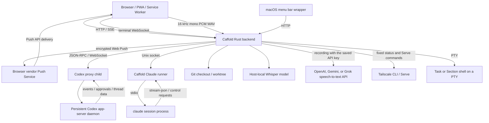

# Architecture

This document maps Caffold's current components and ownership boundaries. It is
not a compatibility contract.

Caffold runs one control instance per trusted host. That instance serves the
UI, drives the native agent selected for each Task, reads the local filesystem
and Git, and exposes Task and review APIs to the browser.


```mermaid
flowchart TD
    PWA["Browser / PWA / Service Worker"]
    MacWrapper["macOS menu bar wrapper"]
    Backend["Caffold Rust backend"]
    PushService["Browser vendor Push Service"]
    Proxy["Codex proxy child"]
    AppServer["Persistent Codex app-server daemon"]
    Runner["Caffold Claude runner"]
    ClaudeSession["claude session process"]
    Git["Git checkout / worktree"]
    Whisper["Host-local Whisper model"]
    SpeechApi["OpenAI, Gemini, or Grok speech-to-text API"]
    Tailscale["Tailscale CLI / Serve"]
    Shell["Task or Section shell on a PTY"]

    PWA -->|"HTTP / SSE"| Backend
    PWA -->|"terminal WebSocket"| Backend
    PWA -->|"16 kHz mono PCM WAV"| Backend
    MacWrapper -->|"HTTP"| Backend
    Backend -->|"JSON-RPC / WebSocket"| Proxy
    Proxy --> AppServer
    Backend -->|"Unix socket"| Runner
    Runner -->|"stdio"| ClaudeSession
    Backend --> Git
    Backend -->|"PTY"| Shell
    Backend --> Whisper
    Backend -->|"recording with the saved API key"| SpeechApi
    Backend -->|"fixed status and Serve commands"| Tailscale
    Backend -->|"encrypted Web Push"| PushService
    PushService -->|"Push API delivery"| PWA
    AppServer -->|"events / approvals / thread data"| Proxy
    ClaudeSession -->|"stream-json / control requests"| Runner
```

## Components

### Browser and PWA

The PWA is the primary and most complete review and control surface. It is
usable from desktop and mobile browsers and owns presentation, selection, and
request state rather than durable product or agent state.

### macOS wrapper

The menu-bar wrapper starts and controls the local backend, reports compact
host status, and participates in application update and recovery. The PWA and
Swift wrapper may expose the same backend-owned setting or action, but they
must not separately infer its state or implement different mutation semantics.
Platform failures before the backend is available, macOS lifecycle, and native
launch behavior remain wrapper-owned.

### Rust backend

The backend owns:

- host instance and HTTP/SSE lifecycle;
- Task membership, routing, and per-Task agent selection;
- the Codex proxy connection and Claude runner supervision;
- translation from each agent into Caffold's conversation, event, approval,
  and failure vocabulary;
- live file, Git, GitHub, and managed-worktree operations;
- each Task's and Section's terminal shell, its PTY, and its restorable screen;
- voice provider selection, saved speech-to-text API keys, the Whisper model's
  download, verification, and memory lifetime, and transcription through the
  selected provider;
- canonical Tailscale status, constrained Serve operations, and private URL/QR
  derivation;
- browser Push subscription persistence and delivery;
- Notes that agents write through Caffold's Notes tools and the browser reads;
  and
- shared server settings, PWA assets, and capabilities consumed by browser and
  platform clients.

It does not own either agent's model harness or transcript. The architecture
and rationale for that boundary belongs to
[Agent Runtimes](agent-runtimes.md).

### Agent runtimes

A Task is bound to Codex, Claude, or Grok. Codex app-server owns Codex thread,
turn, approval, cwd, and event behavior. Claude Code owns its transcript,
stream-json/control behavior, tools, and permission model. Caffold's Claude
runner supplies process survival and frame relay without parsing the agent
protocol. Grok's leader owns Grok sessions, turns, approvals, and the session
record; Caffold's Grok driver keeps only the binding between a Task and the
native session it runs on.

The shared Task application works only in Caffold's small product vocabulary.
Provider wire methods and payloads stop in the driver. See
[Codex App Server](codex-app-server.md) and
[caffold-claude-runner](../../runners/claude/README.md) for the provider and
transport details.

Conversation delivery crosses these ownership boundaries:

```text
Codex app-server or Claude transcript/live process
                        |
                        v
native driver translates provider evidence
                        |
                        v
Tasks backend reconciles one conversation projection
                        |
                        v
Task live sources publish typed snapshots and deltas
                        |
                        v
tab-scoped SSE gateway multiplexes logical channels
                        |
                        v
browser Task Detail renders projection and local layers
```

The provider-owned history and live sources remain authoritative. The backend
projection coordinates their evidence without becoming another transcript,
and the browser does not reconstruct that reconciliation.
[Agent Runtimes](agent-runtimes.md#conversation-and-event-ownership) owns the
evidence and publication contract;
[Frontend Structure](frontend.md#tasks-layout-and-detail-layout) owns its
browser application and rendering consequences.

### Git checkout and worktree

Git is the source of truth for code changes. Caffold derives repository and
worktree context live and presents review surfaces from Git and file contents.
It may create and later remove only worktrees recorded under its managed
ownership contract.

### Voice input

The shared Task composer captures a bounded 16 kHz mono 16-bit PCM WAV and sends
it over the existing same-origin Caffold connection. The backend validates the
recording in memory and transcribes it with the provider selected in
**Settings → Voice Input**:

- Whisper runs the pinned multilingual `large-v3-turbo` model on the host. The
  backend downloads and verifies the model in a background task, loads it on the
  first transcription, serializes inference, and releases it when another
  provider is selected or the model is deleted.
- OpenAI (`gpt-transcribe`), Gemini (`gemini-3.5-transcribe`), and Grok
  (`grok-voice-transcribe-2.0`) receive the recording from the backend with the
  API key saved on the host.

The resulting text is inserted at the saved selection. Caffold never stores
recordings. [Security and Approvals](security-and-approvals.md#voice-input)
defines the key storage and request rules.

## Application ownership

The backend application is split by state and transport owner:

```text
caffold/src/app.rs                     dependency construction and router composition
caffold/src/app/error.rs               shared JSON HTTP error contract
caffold/src/app/shell.rs               shell, health, settings, manifest, static assets
caffold/src/app/workspace.rs           Files, current plan, images, Git, and GitHub adapters
caffold/src/app/workspace/current_plan.rs
                                      read-only current-plan filesystem projection
caffold/src/app/live_updates.rs        tab SSE, logical controls, framing, channel lifetimes
caffold/src/app/notes.rs               Notes operations, Notes tool answers, read-only Notes routes
caffold/src/app/tasks.rs               private Tasks state and runtime shutdown
caffold/src/app/tasks/routes.rs        Task/agent HTTP DTOs, handlers, REST routes
caffold/src/app/tasks/routes/uploads.rs
                                      prompt attachment uploads in the Task working directory
caffold/src/app/tasks/live.rs          typed Task List and Task Detail live capabilities
caffold/src/app/tasks/detail.rs        canonical Task detail and history application
caffold/src/app/tasks/sessions.rs      ephemeral viewer, revision, and live-session state
caffold/src/app/tasks/runtime.rs       per-Task driver routing and orchestration
caffold/src/app/tasks/runtime/
  process.rs                           Codex readiness, connection, generation, restart
  bridge.rs                            Codex event bridge and managed-session recovery
  claude_bridge.rs                     Claude reports, approvals, and served-tool routing
  server_requests.rs                   Codex approvals and dynamic-tool requests
caffold/src/app/tasks/sync.rs          revisioned Task Detail publication channel
caffold/src/app/tasks/projection.rs    pure conversation-to-browser Task projection
caffold/src/app/tasks/events.rs        event normalization, merge, cache, publication
caffold/src/agent.rs                   shared agent vocabulary
caffold/src/agent/driver.rs            closed driver choice and shared operations
caffold/src/agent/notes_tools.rs       Notes tool catalog and argument checks for every agent
caffold/src/agent/codex.rs             Codex app-server boundary
caffold/src/agent/claude.rs            Claude CLI boundary
caffold/src/app/voice.rs               voice settings, Whisper lifecycle, WAV validation, provider routing
caffold/src/app/tailscale.rs           status and constrained Serve orchestration
caffold/src/app/terminal.rs            terminal HTTP/WebSocket routes and the Task close capability
caffold/src/app/terminal/              terminal registry, shells on PTYs, screen snapshots
caffold/src/watch.rs                   reference-counted native filesystem watches
caffold/src/task_store.rs              Caffold-owned durable Task, Notes, and recovery data
runners/claude/                         transport-only Claude process supervisor
```

`caffold/src/app.rs` constructs completed feature applications; it does not own
their state. Route modules own HTTP adaptation. Lower application modules
receive only the capability they use and do not depend on Axum extractors or a
complete route state. Projection and event modules do not become alternate
writers for provider state.

## Sources of truth

| State | Owner |
| --- | --- |
| Codex conversations, turns, activity, and cwd | Codex app-server |
| Claude conversation history | Claude transcript files |
| Live Claude process and control requests | Claude process held by the Caffold runner |
| Task membership, provider, stable navigator name, Section placement, composer state, Push subscriptions, and managed-worktree recovery | Caffold Redb |
| Notes, their directories, and the Tasks that created and last changed them | Caffold Redb |
| Current plan documents and checklist markers | Filesystem under the Task's effective working directory |
| Files, diffs, branches, commits, and worktree contents | Git and the filesystem |
| Tailscale connection, Serve mapping, and Tailnet address | Tailscale CLI and Serve configuration |
| Voice provider selection, saved API keys, and the Whisper model | Files under the Caffold data directory |
| Which Tasks and Sections have a terminal, and each terminal's screen | Backend memory, until the backend exits |
| A terminal's shell and whatever it runs | The shell process on its PTY |
| Browser presentation, selection, and local Push identity | Browser/PWA |

Caffold does not persist provider transcripts, active-turn state, or derived
Git presentation as replacements for their owners. A cache, event, or browser
request may coordinate delivery but does not become canonical domain state.

## Process model

One Caffold backend serves one trusted host and one data directory.

Codex uses one persistent app-server daemon per user. Caffold ensures it is
available and connects through a disposable proxy child. Caffold owns and stops
the proxy, not the daemon.

Claude uses one Caffold runner per data directory and one `claude` child per
live session. The runner outlives a backend replacement so active work and
pending approvals can be recovered. It shuts down after its bounded
no-subscriber interval or an explicit restart. The runner keeps no history;
Claude's transcript does.

The browser can disconnect without stopping either runtime. Task viewer, request,
and runtime leases determine which live subscriptions Caffold maintains, but
they do not redefine agent status.

Terminals have no runner. Each shell is a child of the backend on its own PTY,
read by a backend thread, and ends with the backend. A browser disconnecting
leaves the shell running; [Terminals](terminal.md) owns their lifetime.

The backend also keeps one monitor thread outside its request threads, so it
still runs when every request thread is held up. When the request threads have
run no work for five seconds, it writes to the server log how long they have
been silent, how many files the process holds open against its limit, and
which HTTP requests are still waiting for their handlers. It writes that again
every minute while the stall lasts, and once more when work runs again. It
also writes one line for each HTTP request whose handler has gone a minute
without answering, once per request, so requests that pile up before a stall
leave a trail. The thread ends with the backend.

On macOS, the first stall report also starts `/usr/bin/sample` on a separate
thread to collect three seconds of this backend's thread stacks. This does not
need a browser connection or a manual restart. Reports are saved under
`diagnostics/stalls` in the backend data directory; the server log names each
report. Only one capture runs at a time, the sampler is stopped if it has not
finished within ten seconds, and the most recent ten reports are retained.
The monitor rearms after the runtime runs work again. A later stall starts
another capture unless the previous sampler is still running; an overlapping
request is skipped and logged. A failed helper is logged and its report
annotated, preserving any partial stacks. A report can be incomplete if the
backend exits before collection finishes.

## Task and repository context

Caffold persists which agent runs each Task. A Claude Task also persists its
working directory because a resumed CLI process must be told where to start;
Codex reports the cwd from its own thread; a Grok Task persists its working
directory the same way, and its driver-private binding file records which
native session runs there. For a managed worktree, the ownership record
supplies the active Task root for every driver.

Task Detail derives repository and worktree presentation live from that Task
context. The Active list marks a Task in a Caffold-managed worktree from its
ownership record alone; see
[Codex App Server](codex-app-server.md#active-navigator-projection-and-archived-pagination).
The navigator groups a main checkout and linked worktrees by their common Git
repository while each Task retains its actual worktree root for Integrated
Review, Git, and GitHub.

The optional current-plan projection also starts from the Task's actual cwd,
not a repository or managed-worktree fallback. It reads the exact
`.caffold/plans/current` pair directly from the filesystem and stores no plan
record in Redb. The user contract is defined in
[Product Workflows](../product/workflows.md#current-plan-documents); filesystem
invalidation and browser recovery are defined in
[Live Updates](live-updates.md#filesystem-watch).

An eligible Task can explicitly move its same conversation into a
Caffold-managed worktree. The ownership record permits bounded recovery,
archive removal, and restore only for paths Caffold created and verified. An
external worktree may be used as a cwd but is never adopted or removed from
path inference alone. See [Managed Worktree Lifecycle](worktree-lifecycle.md).
