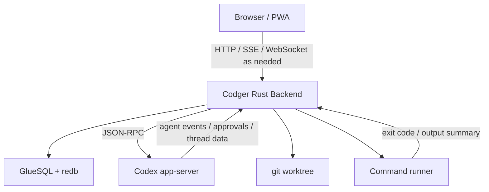

# Architecture Sketch

This is an initial architecture sketch, not a fixed public contract.

Codger is organized around one control instance per trusted host.

That instance is expected to serve the UI, store Codger metadata, manage Codex app-server, talk to git, and expose task/review APIs to the browser.

## Components

### PWA

The PWA is the review and control surface. It should be usable from desktop and mobile browsers. It does not own the source of truth.

### Rust Backend

The backend owns:

- host instance lifecycle
- project and task registry
- worktree creation and lookup
- Codex app-server child process lifecycle
- JSON-RPC adapter
- git status, diff, log, and file APIs
- command runner
- operation ledger writes
- PWA asset serving

### Codex App Server

Codex app-server owns Codex thread, turn, approval, and event stream behavior. Codger should treat it as an external integration boundary rather than embedding Codex internals in the first implementation.

### GlueSQL + redb

The database stores Codger-owned state:

- host records
- projects
- tasks
- worktree paths
- Codex thread IDs
- task status
- command/test summaries
- operation ledger events
- UI-facing snapshots where useful

It should not duplicate the full Codex transcript or all command output by default.

### Git Worktree

The worktree is the source of truth for code changes. Codger reads from git and file contents to present review surfaces.

## Source of Truth

- Codex thread/session: conversation, turns, agent activity
- git worktree: actual file and code changes
- GlueSQL/redb: Codger task metadata and operation events
- PWA: view and controller only

## Process Model

The initial model is one Codger backend instance per host. That backend manages one Codex app-server process for the host unless implementation evidence later suggests a different process model.

Tasks are normally bound to one worktree and one Codex thread.
