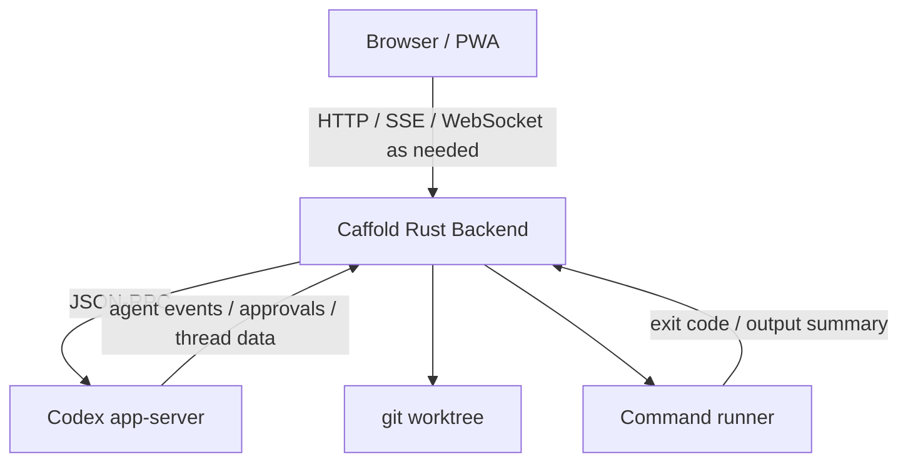

# Architecture Sketch

This is an initial architecture sketch, not a fixed public contract.

Caffold is organized around one control instance per trusted host.

That instance serves the UI, manages Codex app-server, talks to the local filesystem and git, and exposes task/review APIs to the browser.

## Components

### PWA

The PWA is the review and control surface. It should be usable from desktop and mobile browsers. It does not own the source of truth.

### Rust Backend

The backend owns:

- host instance lifecycle
- live file, git, and worktree-context lookup
- Codex app-server child process lifecycle
- JSON-RPC adapter
- git status, diff, log, and file APIs
- command runner
- PWA asset serving

### Codex App Server

Codex app-server owns Codex thread, turn, approval, and event stream behavior. Caffold should treat it as an external integration boundary rather than embedding Codex internals in the first implementation.

### Git Worktree

The worktree is the source of truth for code changes. Caffold reads from git and file contents to present review surfaces.

## Source of Truth

- Codex thread/session: conversation, turns, agent activity
- git worktree: actual file and code changes
- PWA: view and controller only

## Process Model

The initial model is one Caffold backend instance per host. That backend manages one Codex app-server process for the host unless implementation evidence later suggests a different process model.

Codex threads are the Tasks source of truth. Caffold derives repository and
worktree context live from each thread cwd and does not keep a separate project
or task registry. Open Tasks groups the main checkout and linked worktrees by
their shared Git repository while each Task keeps its actual worktree root for
Files and Diff. Worktree lifecycle operations remain outside the current Tasks
surface.
