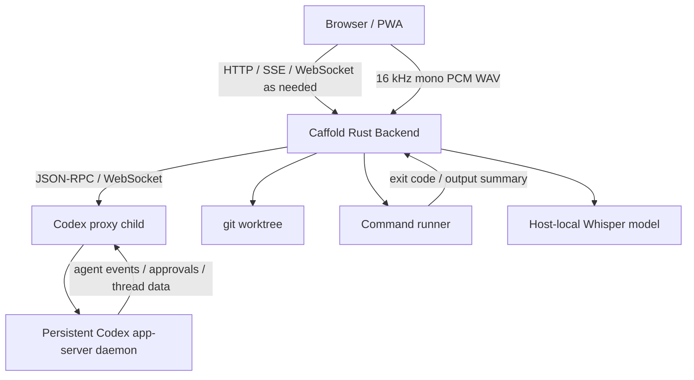

# Architecture Sketch

This is an initial architecture sketch, not a fixed public contract.

Caffold is organized around one control instance per trusted host.

That instance serves the UI, manages Codex app-server, talks to the local filesystem and git, and exposes task/review APIs to the browser.


```mermaid
flowchart TD
    PWA["Browser / PWA"]
    Backend["Caffold Rust Backend"]
    Proxy["Codex proxy child"]
    AppServer["Persistent Codex app-server daemon"]
    Git["git worktree"]
    Commands["Command runner"]
    Whisper["Host-local Whisper model"]

    PWA -->|"HTTP / SSE / WebSocket as needed"| Backend
    PWA -->|"16 kHz mono PCM WAV"| Backend
    Backend -->|"JSON-RPC / WebSocket"| Proxy
    Proxy --> AppServer
    Backend --> Git
    Backend --> Commands
    Backend --> Whisper
    AppServer -->|"agent events / approvals / thread data"| Proxy
    Commands -->|"exit code / output summary"| Backend
```

## Components

### PWA

The PWA is the review and control surface. It should be usable from desktop and mobile browsers. It does not own the source of truth.

### Rust Backend

The backend owns:

- host instance lifecycle
- live file, git, and worktree-context lookup
- Codex app-server daemon connection and disposable proxy lifecycle
- JSON-RPC adapter
- git status, diff, log, and file APIs
- command runner
- host-local Whisper model installation, verification, and transcription
- PWA asset serving

The application layer is split by the state and transport boundary it owns:

```text
src/app.rs                     dependency construction and router composition
src/app/error.rs               shared JSON HTTP error contract
src/app/shell.rs               shell, health, settings, manifest, static assets
src/app/workspace.rs           Files, images, watches, Git, and GitHub HTTP adapters
src/app/tasks.rs               private Tasks state assembly and runtime shutdown
src/app/tasks/routes.rs        Tasks/Codex HTTP DTOs, validation, handlers, REST/SSE routes
src/app/tasks/detail.rs        canonical task detail, session, history, and sync application
src/app/tasks/runtime.rs       app-server process, notification, and approval lifecycle
src/app/tasks/sync.rs          rollout invalidation scheduling and retry timing
src/app/tasks/projection.rs    pure thread/turn to browser task projection
src/app/tasks/events.rs        event normalization, merge, cache, and publication
src/app/voice.rs               model lifecycle, WAV validation, and local transcription
```

`src/app.rs` does not own feature state. It constructs the Shell, Workspace, and
Tasks applications and merges their completed routers. Each HTTP owner keeps
its route state and DTOs private. Tasks lower modules receive only the
capabilities they use; they do not depend on Axum extractors or the full Tasks
route state. Within Tasks, Projection and Events are the stateless or
bounded-memory base, Runtime owns app-server transport, Sync owns scheduling,
Detail applies canonical reads, and Routes adapts those owners to HTTP.

### Codex App Server

Codex app-server owns Codex thread, turn, approval, and event stream behavior. Caffold should treat it as an external integration boundary rather than embedding Codex internals in the first implementation.

### Git Worktree

The worktree is the source of truth for code changes. Caffold reads from git and file contents to present review surfaces.

### Voice Input

The shared task composer captures microphone samples with an AudioWorklet and
creates a bounded 16 kHz mono 16-bit PCM WAV in the browser. It sends that WAV
over the existing same-origin Caffold connection. The backend validates and
decodes it in memory, lazily loads the pinned multilingual Whisper `small`
model, serializes inference, and returns text for insertion at the selection
saved when recording began. It never stores raw recordings or calls an external
speech-to-text service. The model remains loaded for the backend process
lifetime; Tailscale is transport for remote browsers, not part of inference.

## Source of Truth

- Codex thread/session: conversation, turns, agent activity
- Caffold Redb: managed-thread membership, recency-only ordering cache, composer settings, and seen state
- git worktree: actual file and code changes
- PWA: view and controller only

## Process Model

The initial model is one persistent Codex app-server daemon per user. A Caffold
backend ensures that daemon is running and connects through a proxy child that
may be replaced independently. Caffold owns and stops the proxy, not the daemon.

Codex remains the source of truth for thread content and runtime state. Caffold
keeps one local `managed_threads` table for the subset explicitly continued in
Caffold. The table contains only the thread ID, last observed canonical recency,
claimed/opened/seen timestamps, and optional model/reasoning settings. It never
stores title, preview, cwd, Codex timestamps, status, active turn, or event
summary. The recency value is only an ordering cache; list rows are rebuilt from
successful canonical `thread/read` responses before being returned. Caffold derives
repository and worktree context live from each thread cwd and does not keep a
project registry. Tasks globally groups the main checkout and linked worktrees by
their shared Git repository while each Task keeps its actual worktree root for
Files and Diff. Worktree lifecycle operations remain outside the current Tasks
surface.
