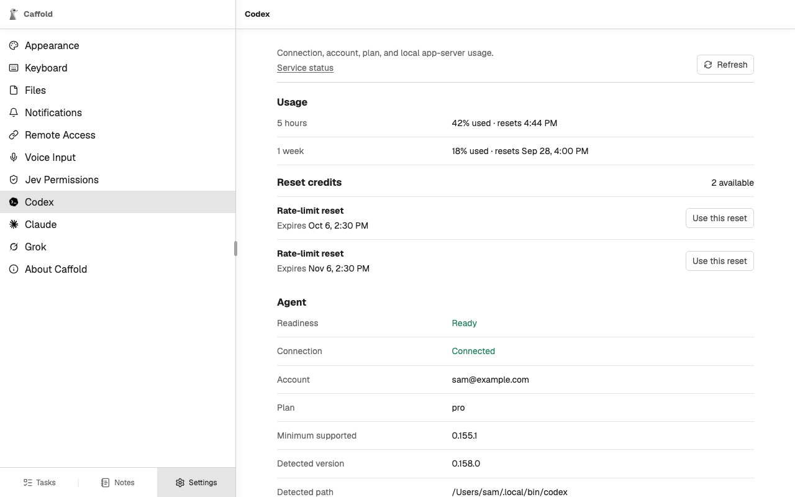

# Set up your agents

Caffold works with the coding agents already installed on the Mac. Install and
sign in to at least one of them; New Task offers the models of every agent
Caffold can reach.

Caffold uses each agent's own sign-in. It never reads or stores your agent
credentials, and it does not install the agents for you.

## Codex

Caffold supports the official standalone Codex CLI `0.155.1` or newer,
installed at `~/.local/bin/codex`. A Codex installed another way, for example
with Homebrew, is reported as unsupported. Install it, then run `codex` once
and complete sign-in:

```sh
curl -fsSL https://chatgpt.com/codex/install.sh | sh
codex
```

**Settings → Codex** reports whether Codex is installed, signed in, and ready,
and says how to fix it when it is not. A Codex problem blocks only Codex: your
existing Tasks stay readable, and Claude Code and Grok keep working.



Codex's own automatic updates restart it in the middle of running work, so
Caffold turns them off unless you have set them yourself in Codex's settings.
Update Codex from **Settings → Codex** instead; see
[Updates](../reference/updates.md#codex).

## Claude Code

Caffold supports Claude Code `2.1.259` or newer. Install it with its official
setup, run `claude` once, and complete sign-in. Caffold looks for `claude` on
its `PATH`, which includes `~/.local/bin`, `/opt/homebrew/bin`, and
`/usr/local/bin`.

**Settings → Claude** shows your usage as Claude reports it, the version and
path Caffold found, the signed-in account and plan, and the state of Caffold's
runner, a small process that keeps Claude Code sessions going while the
Caffold server restarts. When a Claude operation cannot run, the Task shows
Claude's own error.

## Grok

Caffold supports the Grok CLI `1.0.30` or newer. Install it with its official
setup, run `grok` once, and complete sign-in. Caffold looks for `grok` on its
`PATH` and at `~/.grok/bin/grok` and `~/.local/bin/grok`.

The first time Caffold needs Grok, it starts a Grok background process of its
own, which **Settings → Grok** shows as its **Leader**. The leader keeps Grok
turns running while the Caffold server restarts, and it stays running after
Caffold quits. **Settings → Grok** also shows your usage, the version and path
Caffold found, and the signed-in account.

Next, [run your first Task](first-task.md).
