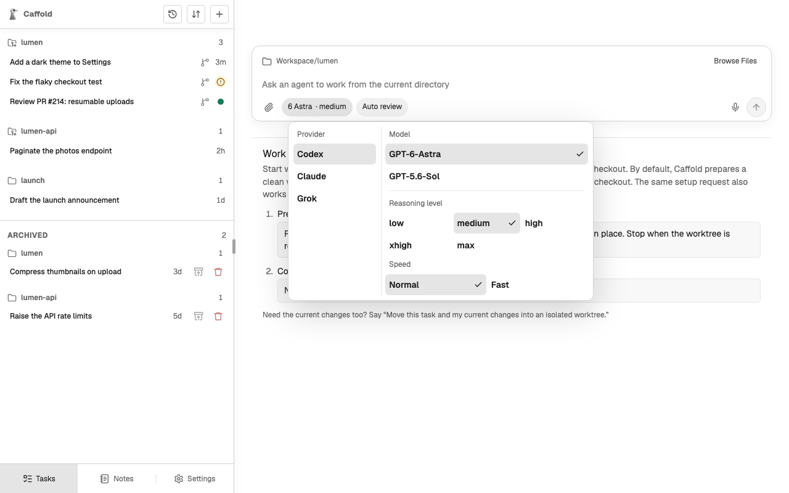

# Your first Task

This walk-through takes one small change from request to review. It assumes
Caffold is [installed](install.md) and at least one
[agent is set up](agents.md).

## 1. Ask for the work



1. Choose **Open Caffold** from the menu-bar app.
2. Choose **New Task** (+) at the top of the Task list.
3. Choose **Browse Files**, select the repository you want to work in, and
   choose **Use This Folder**.
4. Open the model menu and choose a model. The agent that offers it will run
   the Task.
5. Describe the change, for example:

   ```text
   Add a dark theme to the Settings page. Follow the system setting by default, let people override it, and add tests.
   ```

6. Send it.

The Task opens and the agent starts working. After a while it gives the Task a
short name.

## 2. Follow along

The conversation fills in as the agent works: its messages, the commands it
runs, and the files it changes. If it needs permission for something, a
request appears in the conversation; read it and choose an answer. See
[Approvals](../tasks/approvals.md).

You can leave at any point. If the turn finishes while you are away, the Task
list shows a dot next to the Task.

## 3. Review the result

When the turn ends, read the agent's answer, then choose **Working Tree** to
see the changed files and their diffs.


## 4. Continue

Go back to **Conversation** and write what should happen next: a correction, a
follow-up, or a request to commit. Each message continues the same
conversation with the same agent.

From here:

- [Use Caffold from your phone](other-devices.md).
- [Keep the Task's changes in their own worktree](../tasks/worktrees.md).
- [Get notified when a turn ends](notifications.md).
