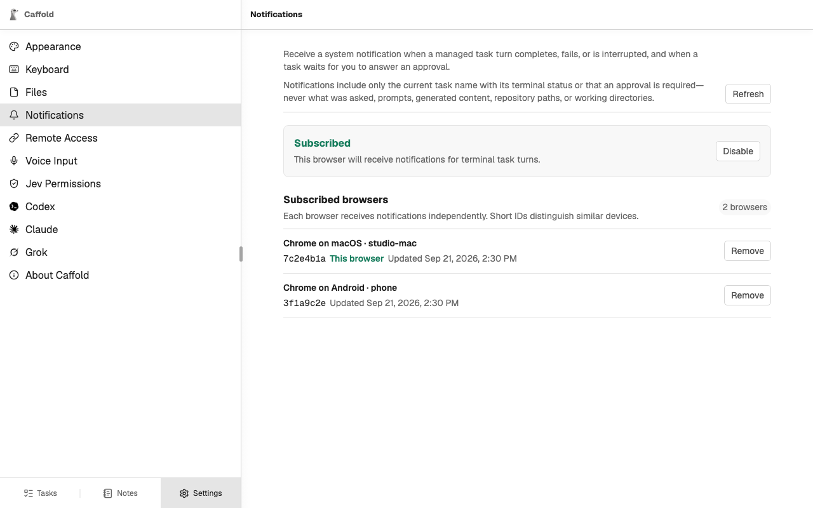

# Notifications

Caffold can send a system notification when a turn ends or when a Task needs
your answer, so you can leave a long turn running and come back when it
matters.

## Turn on notifications

Each browser or installed app turns them on separately:

1. Open **Settings → Notifications** in that browser.
2. Choose **Enable** and allow notifications when the browser asks.

On an iPhone or iPad,
[install Caffold as an app](other-devices.md#open-caffold-on-another-device)
first; the page says so until you do.

## When a notification arrives

You get a notification when a Task's turn completes, fails, or is interrupted,
and when a Task is waiting for your answer to an approval request.

A notification shows only the Task's name with its status, or that an approval
is required. It never contains what the agent asked to do, your prompts, what
the agent wrote, or repository paths. Open the Task to read and answer.

## Subscribed browsers

**Settings → Notifications** lists every browser that receives notifications,
with a short ID to tell similar devices apart. **Remove** stops notifications
to that browser.

## Delivery

Notifications are sent only while the Caffold server is running, and one that
could not be delivered is not tried again later. Delivery passes through the
browser vendor's push service, which cannot read the encrypted message.
