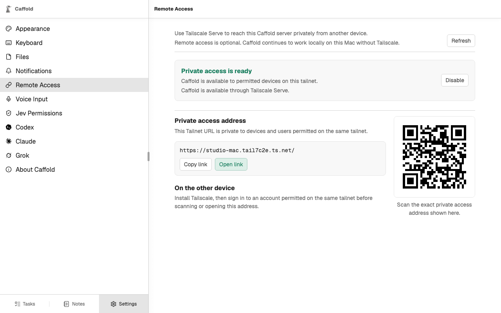
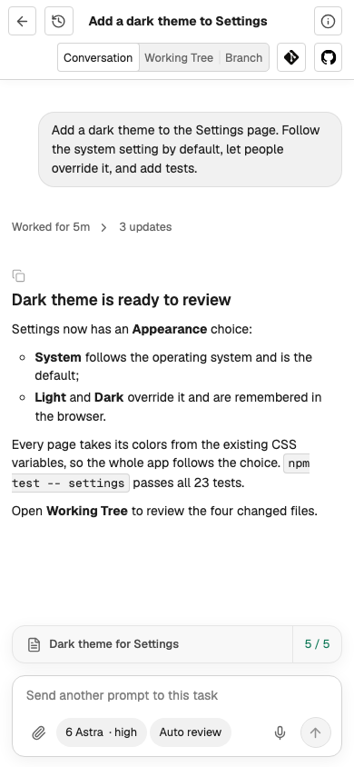

# Use other devices

A phone, a tablet, or another computer opens the same Caffold as the Mac: the
same Tasks, conversations, and approvals. It reaches the Mac through a private
HTTPS address that [Tailscale](https://tailscale.com/download) provides, which
only devices signed in to your tailnet can open.

## Turn on private access

1. Install Tailscale on the Mac and connect it to your tailnet.
2. On the Mac, open Caffold and go to **Settings → Remote Access**. On other
   devices this page is read-only.
3. Choose **Enable**.

When the page reports **Private access is ready**, it shows the private
address with **Copy link**, **Open link**, and a QR code for it.

## Open Caffold on another device

1. Install Tailscale on the device and sign in to an account permitted on the
   same tailnet.
2. Scan the QR code, or open the copied address. On another device, always use
   this address: `127.0.0.1` on a phone points at the phone, not at the Mac.
3. To keep Caffold on the home screen, install it as an app. In Safari on an
   iPhone or iPad, choose **Share**, then **Add to Home Screen**. In Chrome,
   open the browser menu and choose **Add to Home screen** or **Install app**.

{ width="300" }

The installed app has its own window and icon, and it updates with the Mac.
You can install the app on the Mac itself as well, from
`http://127.0.0.1:5178`.

To be told when a turn ends while you are away, turn on
[Notifications](notifications.md) on the device.

## More than one Mac

If you run Caffold on more than one Mac, give each one its own **Name** under
**Server Settings...** in its [menu-bar app](../reference/menu-bar-app.md)
before installing it on a device, so the installed apps can be told apart. An
app installed earlier keeps its old name until you install it again.
