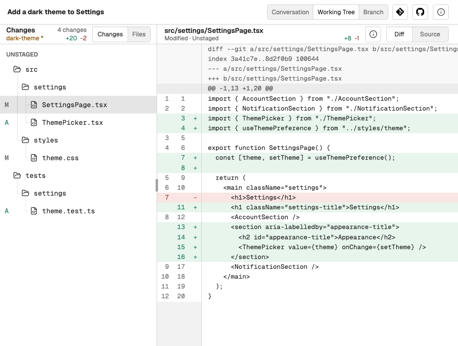
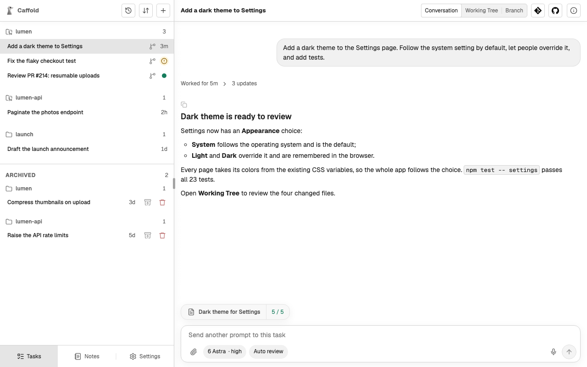
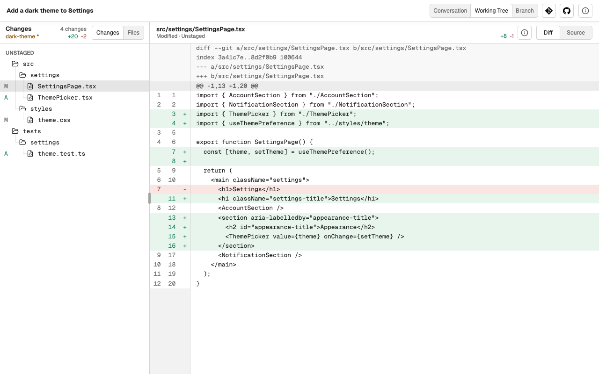
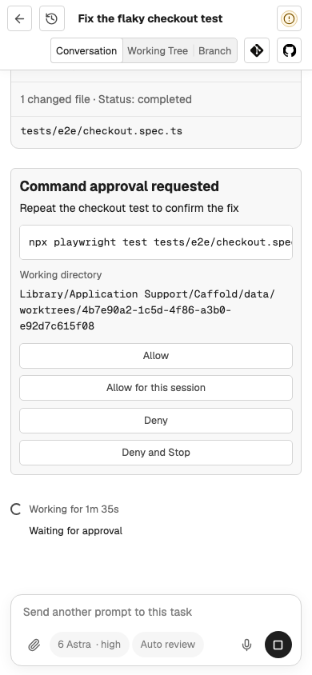

<section class="cf-hero" markdown>

<p class="cf-eyebrow">Caffold · self-hosted on your Mac</p>

<h1><span>Leave your desk.</span> <span>Keep working.</span></h1>

<p class="cf-lede">Codex, Claude Code, and Grok run on your Mac. From a
desktop, a tablet, or a phone, follow their work, answer their approvals, read
the actual diff, and send the next instruction. Unfold a foldable, and you have
the whole workspace.</p>

<div class="cf-actions" markdown>
[Get started](get-started/how-caffold-works.md){ .cf-button .cf-button--primary }
[View on GitHub](https://github.com/panarch/caffold){ .cf-button }
</div>

```sh
brew install --cask panarch/tap/caffold
```

</section>

<div class="cf-devices" markdown>

<figure class="cf-device" markdown>

<figcaption>Unfolded foldable · Working Tree</figcaption>
</figure>

<figure class="cf-device" markdown>

<figcaption>Phone · Conversation</figcaption>
</figure>

</div>

<section class="cf-section" markdown>

## The loop stays with you

<div class="cf-steps" markdown>

<div class="cf-step" markdown>
<span class="cf-step-number">01</span>

### Ask

Start a Task where the work belongs, choose a Codex, Claude, or Grok model,
and describe the work, with files or screenshots if they help.
</div>

<div class="cf-step" markdown>
<span class="cf-step-number">02</span>

### Follow

Watch the conversation as it happens and answer the agent's approval requests
while it works.
</div>

<div class="cf-step" markdown>
<span class="cf-step-number">03</span>

### Review

Read the answer, the commands and tests it ran, the changed files, and the
actual diff.
</div>

<div class="cf-step" markdown>
<span class="cf-step-number">04</span>

### Continue

Say what comes next, from a fix to a commit, a worktree, or a Note. Steer a
running turn, or pick up the same Task later.
</div>

</div>

<figure class="cf-shot" markdown>

</figure>

</section>

<section class="cf-section" markdown>

## The agents you already use

Caffold does not reimplement the agents. It runs each one you have installed,
with its own sign-in, models, approval modes, and conversation history.

<div class="cf-agents" markdown>

<div class="cf-agent" markdown>
### Codex

The official Codex CLI, through the same runtime Codex's own apps use.
</div>

<div class="cf-agent" markdown>
### Claude Code

The Claude Code CLI, picking up each conversation from Claude's own history.
</div>

<div class="cf-agent" markdown>
### Grok

The Grok CLI, with sessions that keep running while Caffold restarts.
</div>

</div>

[Set up your agents](get-started/agents.md){ .cf-more }

</section>

<section class="cf-section cf-split" markdown>

<div markdown>

## Read the real changes

The answer is only the agent's summary. Next to every conversation, Caffold
keeps the repository it worked in:

- the uncommitted changes and the branch, file by file, with their diffs;
- comparisons between any two refs, and the commit history;
- the repository's Issues and Pull Requests, each of which can start a Task.

[Review changes](review/changes.md){ .cf-more }

</div>

<figure class="cf-shot" markdown>

</figure>

</section>

<section class="cf-section cf-split cf-split--phone" markdown>

<figure class="cf-shot cf-shot--phone" markdown>

</figure>

<div markdown>

## Any screen, the same Task

A desktop, a foldable, a tablet, and a phone all open the same Tasks. The
layout changes with the screen, the work does not.

- Reach the Mac privately from your other devices with Tailscale.
- Install Caffold as an app and get notified when a turn ends or an approval
  waits.
- Attach files and screenshots to any prompt.
- Dictate prompts, on the Mac or with your own speech-to-text key.
- Run actions and scroll from the keyboard on a desktop.

[Use other devices](get-started/other-devices.md){ .cf-more }

</div>

</section>

<section class="cf-section" markdown>

## Your Mac, your data

Caffold is not a hosted service. The agents, your repositories and
credentials, and the conversations stay on the Mac you run it on. Other devices
reach it through your own private network, and nothing leaves the Mac for
voice input or permission review unless you turn it on.

[Data and privacy](reference/data-and-privacy.md){ .cf-more }

</section>

<section class="cf-closing" markdown>

## Install Caffold

Caffold runs on Apple silicon Macs with macOS 14 or later.

```sh
brew install --cask panarch/tap/caffold
```

[Install guide](get-started/install.md){ .cf-button }

</section>
