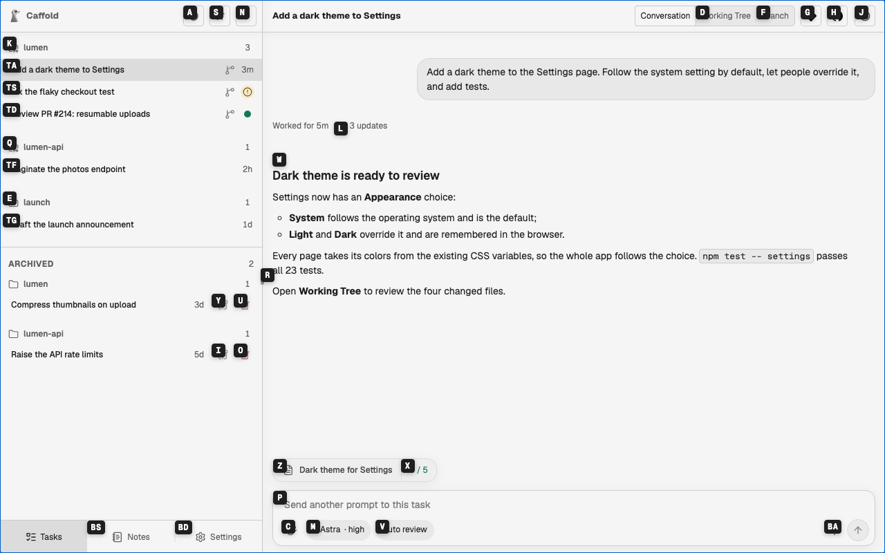
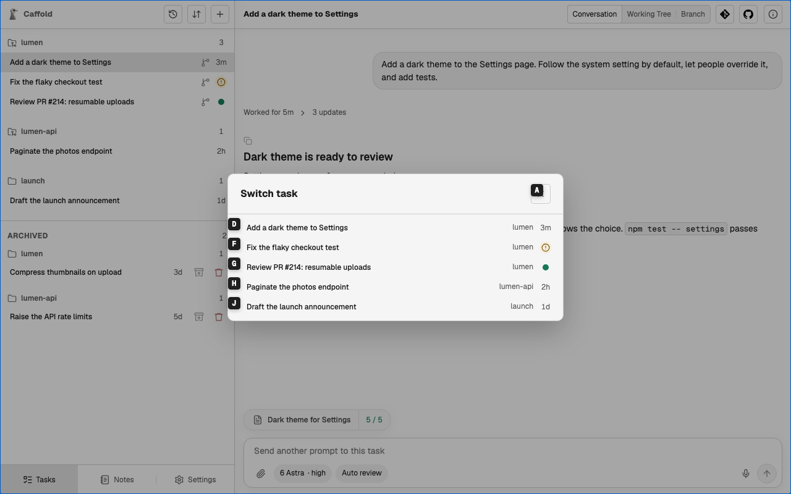
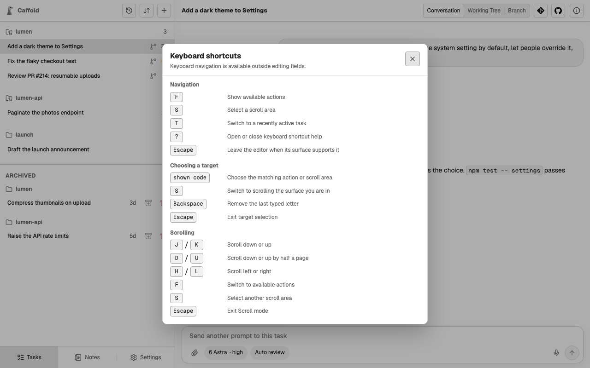

# Keyboard navigation

With a keyboard, you can run the actions on the screen and scroll its areas
without a pointer. The keys work whenever you are not typing in a field.

## Choose an action: <kbd>F</kbd>

Press <kbd>F</kbd> and short codes appear on the actions you can take in the
current place: the workspace, or the dialog or popover that is open. Type a
code to run its action.

- <kbd>Backspace</kbd> removes the last letter you typed.
- <kbd>Esc</kbd> leaves without choosing.

## Scroll an area: <kbd>S</kbd>

Press <kbd>S</kbd> to put codes on the areas that scroll, then type a code to
choose one. In the chosen area:

| Keys | Scrolls |
| --- | --- |
| <kbd>J</kbd> / <kbd>K</kbd> | down or up a little |
| <kbd>D</kbd> / <kbd>U</kbd> | down or up by half the area |
| <kbd>H</kbd> / <kbd>L</kbd> | left or right |

Press <kbd>S</kbd> to choose another area, <kbd>F</kbd> to switch to actions,
or <kbd>Esc</kbd> to stop scrolling.

## Switch Tasks: <kbd>T</kbd>

On the Tasks screen, <kbd>T</kbd> opens the Task Switcher with codes already on
its rows. It lists your active Tasks, the most recently finished first, so the
Task you just heard back from is at the top. Type a row's code, or choose a
row, to open that Task. The **Switch task** button, the clock at the top of the
Task list, opens the same list.

## Leave a field: <kbd>Esc</kbd>

While you are typing a prompt, the keys go into the prompt. Press <kbd>Esc</kbd>
to leave the prompt, and the keys work again.

## Shortcut help: <kbd>?</kbd>

<kbd>?</kbd> opens the list of keyboard shortcuts from anywhere, including in
the middle of choosing an action or scrolling. Press <kbd>?</kbd> or
<kbd>Esc</kbd> to close it.

## Turn it off

Keys with <kbd>Ctrl</kbd>, <kbd>Alt</kbd>, or <kbd>⌘</kbd>, and keys typed
while an input method is composing, always go to the browser. To give every
single key back to the browser as well, turn off **Keyboard navigation** in
**Settings → Keyboard**, which also lists all the shortcuts.
