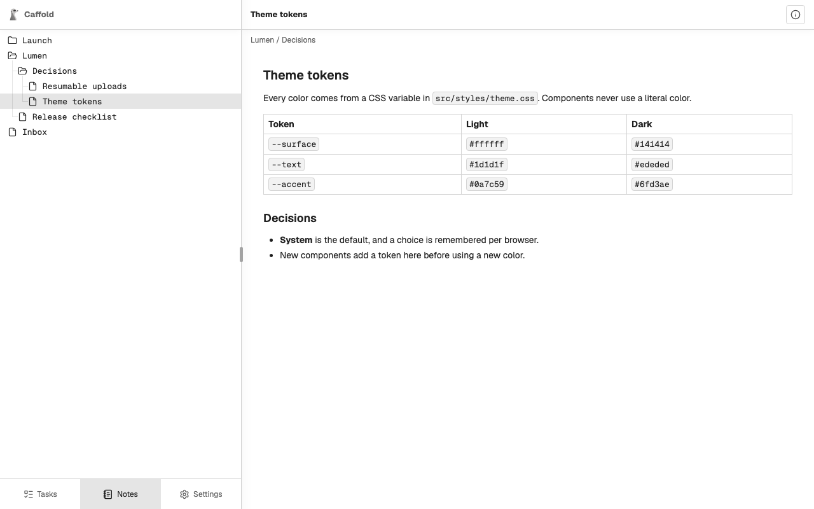

# Notes

Notes are Markdown documents your agents keep for you across Tasks: decisions,
findings, checklists you reuse. A Note belongs to no Task, Section, or
repository, and every Task's agent reaches the same Notes.

## Keep Notes through an agent

Ask the agent in any Task, in your own words:

- "Save what we decided about theme tokens as a Note under Lumen / Decisions."
- "Add the new color to the Theme tokens Note."
- "Read the Release checklist Note before you start."

Every Codex, Claude Code, and Grok Task has Caffold's Notes tools. With them
the agent can create, read, rename, move, rewrite, and delete Notes and the
folders that hold them. A folder can be deleted only once it is empty.

Two Tasks cannot overwrite each other's changes by accident: a change made to
an outdated copy of a Note is refused, and the agent reads the Note again
first.

## Read Notes

Open **Notes** at the bottom of the navigation pane. The tree lists folders
first, then Notes, each by name. Choose a Note to read it, beside the tree on a
wide screen or in its place on a phone, where **Back** returns to the tree.

**Note details** at the top right shows when the Note was created and last
changed, and which Task did each, with a link to that Task's conversation.

The open Note does not change on screen by itself. Notes reads the tree and
the Note again whenever you come back to it or bring the app back to the
foreground.

Notes is for reading. To change a Note, ask an agent.

## Where Notes are kept

Notes are stored with Caffold's data on the Mac. Caffold does not keep earlier
versions of a Note, so content an agent rewrites or deletes cannot be
recovered, and uninstalling with `--zap` deletes every Note. See
[Data and privacy](../reference/data-and-privacy.md).
