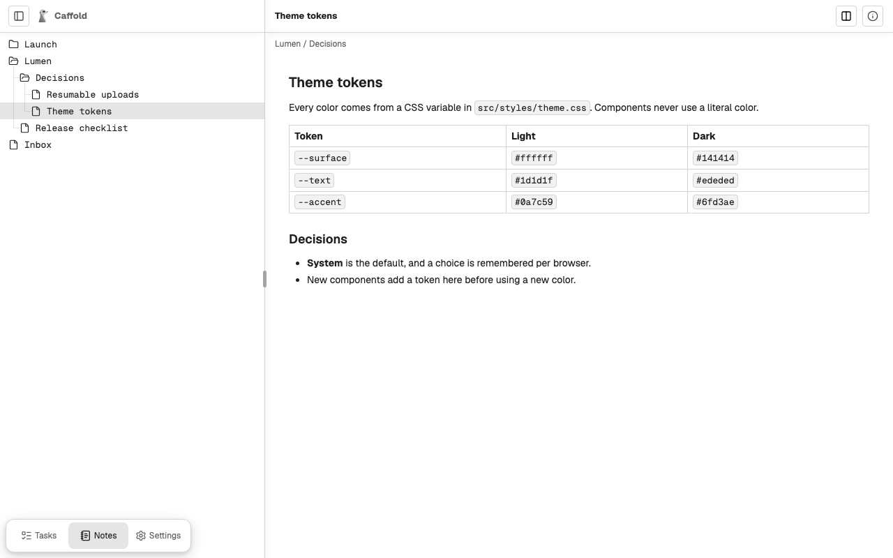
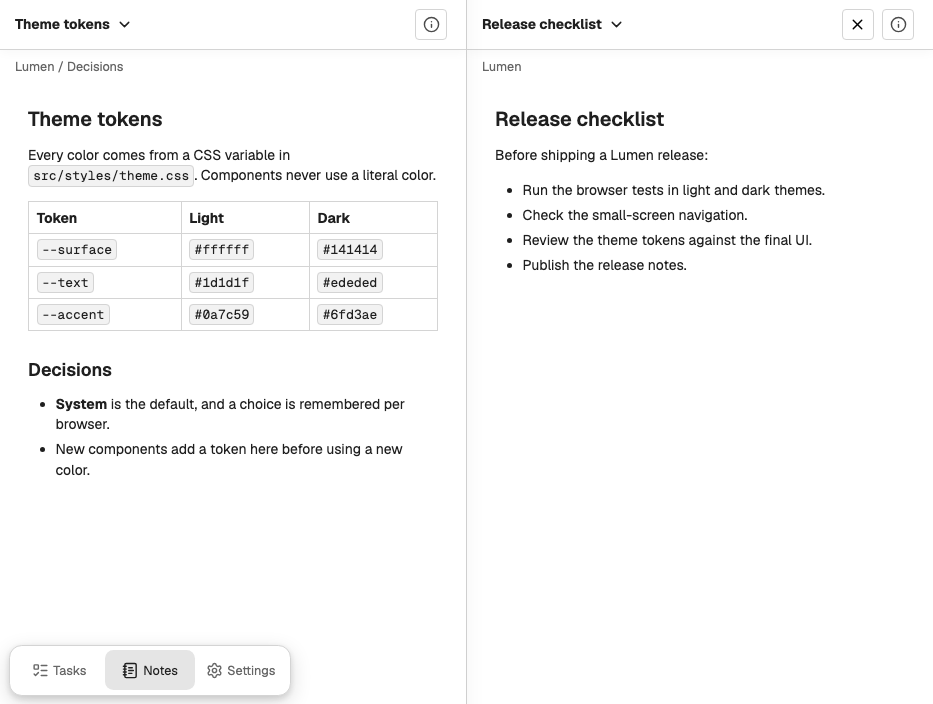
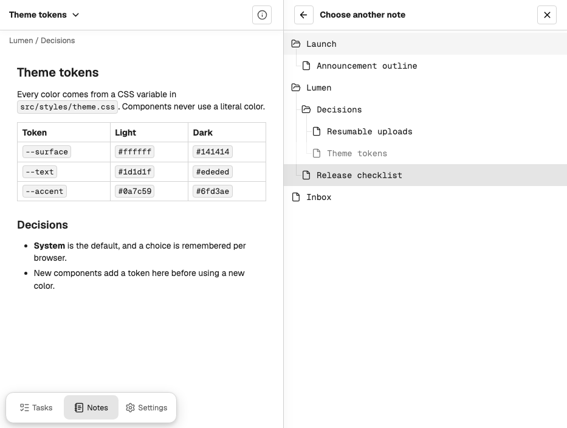

# Keep and read Notes

Notes are Markdown documents your agents keep for you across Tasks: decisions,
findings, checklists you reuse. A Note belongs to no Task, Section, or
repository, and every Task's agent reaches the same Notes.

## Keep Notes through an agent

Ask the agent in any Task, in your own words:

- "Save what we decided about theme tokens as a Note under Lumen / Decisions."
- "Add the new color to the Theme tokens Note."
- "Read the Release checklist Note before you start."

Every Codex, Claude Code, and Grok Task has Caffold's Notes tools. With them
the agent can create, read, rename, move, rewrite, and delete Notes and the
folders that hold them. A folder can be deleted only once it is empty.

Two Tasks cannot overwrite each other's changes by accident: a change made to
an outdated copy of a Note is refused, and the agent reads the Note again
first.

## Read Notes

Open **Notes** at the bottom of the navigation pane. The tree lists folders
first, then Notes, each by name. Choose a Note to read it, beside the tree on a
wide screen or in its place on a phone, where **Back** returns to the tree.

**Note details** at the top right shows when the Note was created and last
changed, and which Task did each, with a link to that Task's conversation.

In Note details, **Copy path** copies the Note's path and id to paste to an
agent, and **Copy Markdown** copies its content.

The open Note does not change on screen by itself. Notes reads the tree and
each open Note again whenever you come back to it or bring the app back to the
foreground.

Notes is for reading. To change a Note, ask an agent.

## Read two Notes side by side

Keep a decision open while reading the checklist that puts it into practice.
In this example, **Theme tokens** holds Lumen's color and theme decisions;
**Release checklist** lists what to check before shipping, including those
tokens. Read the reference and the checklist together without switching
between them.

On a wide screen:

1. Open the Note you want to keep as a reference, then choose **View side by
   side**, the two-column icon in its header.
2. Choose a second Note from the tree on the right. The reference stays on
   the left.
3. Choose the right Note's title to read another Note beside the same reference.
   Either title can replace the Note in its own pane.

Here, **Theme tokens** stays open while you choose **Announcement outline**
to read next on the right.

The return arrow cancels selection and brings back the Note you were reading.
**Close side by side** on the right returns to the tree and the left Note,
including when you are choosing a replacement.

**Tasks**, **Notes**, and **Settings** stay at the bottom left. Switch away and
return to Notes to keep the same pair and reading positions. On a narrow
screen, the left Note fills the screen; widening it brings the pair back.

## Where Notes are kept

Notes are stored with Caffold's data on the Mac. Caffold does not keep earlier
versions of a Note, so content an agent rewrites or deletes cannot be
recovered, and uninstalling with `--zap` deletes every Note. See
[Data and privacy](../reference/data-and-privacy.md).
