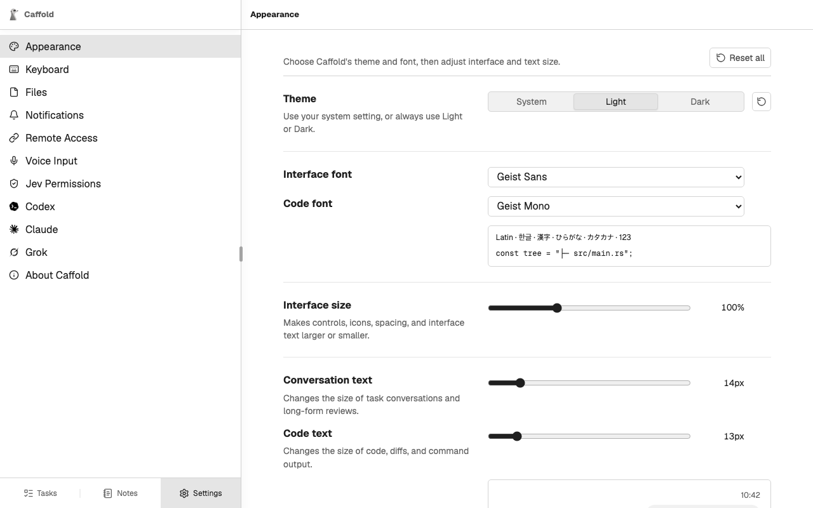

# Settings

Open **Settings** at the bottom of the navigation pane. What you set in
**Appearance**, **Keyboard**, and **Files** is saved in each browser;
everything else is saved on the Mac.

## Appearance

**Theme** is **System**, **Light**, or **Dark**. **Interface font**
and **Code font** choose the typefaces, with a sample below them.
**Interface size** scales controls and interface text, while
**Conversation text** and **Code text** set the size of conversations and of
code, diffs, and command output. **Reset all** returns to the defaults.

## Keyboard

Turns **Keyboard navigation** on or off and lists its shortcuts. See
[Keyboard navigation](../keyboard.md).

## Files

Orders the file trees in Working Tree, Branch, Git, and GitHub: **Folders first**,
or **All entries by name**. The folder picker of New Task always lists folders
first.

## Notifications, Remote Access, and Voice Input

- [Notifications](../get-started/notifications.md): this browser's notifications,
  and every browser that receives them.
- [Remote Access](../get-started/other-devices.md): the private address for your
  other devices.
- [Voice Input](../voice-input.md): how dictation becomes text.

## Jev Permissions

The TypeSafe API key and extra rules for **Ask Jev first**. See
[Ask Jev first](../tasks/ask-jev-first.md#set-it-up).

## Codex, Claude, and Grok

Each agent's page opens with your plan's usage as the agent reports it,
followed by what Caffold found: the installed version and path, the signed-in
account, and the state of the process Caffold talks to. **Service status**
opens the provider's status page, and **Refresh** reads everything again.

- **Codex** also says how to fix an installation that is not ready, and offers
  **Restart runtime…** and **Update Codex…**. See
  [Updates](updates.md#codex).
- **Claude** offers **Restart runtime**. See
  [Updates](updates.md#claude-code-and-grok).
- **Grok** shows Caffold's Grok leader and the connection to it.

### Codex reset credits

When Codex has rate-limit reset credits, **Settings → Codex** lists them under
the usage, each with its expiry.

**Use this reset** asks Codex to use that credit to reset an eligible usage
limit. It asks for confirmation first, because a used credit cannot be
restored. If Codex counts credits it does not list, **Let Codex choose a reset**
uses one of those. If Caffold cannot confirm what happened,
**Retry previous reset request** sends the same request again, and Codex will
not use a second credit for it.

## About Caffold

The version and build of Caffold and whether an update is ready. **Reload to
update** loads a new version into this window, and **Copy diagnostics** copies
the details to include in a bug report.
