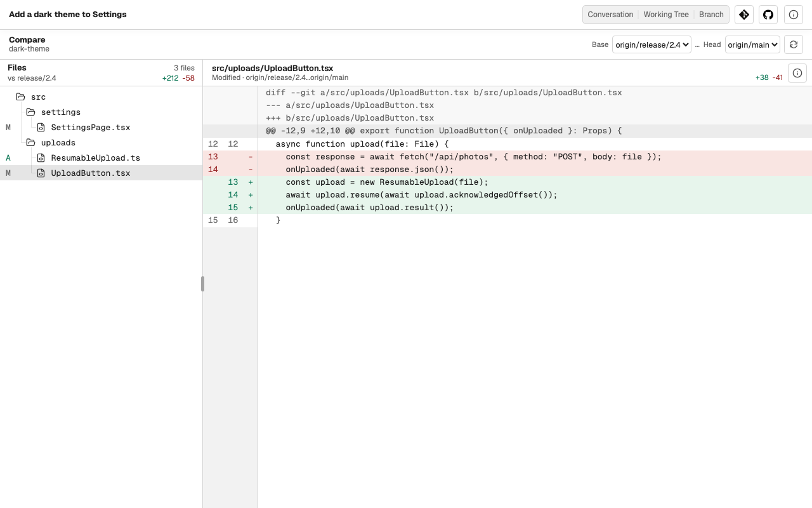

# Git

The Git button, with the Git logo, at the top of a Task or a repository
Section opens a menu with **Compare** and **Log**. Everything there is
read-only.

## Compare

**Compare** shows the files that differ between any two refs, a **Base** and a
**Head**, and the diff of each file. Neither ref has to be the Task's current
branch.

## Log

**Log** lists the commits of the current branch, a page at a time. Open a
commit to see its changed files and their diffs; **Back to log** returns to
the list.

The refresh button in **Log**, **Fetch remote**, updates the remote-tracking
copy of the default branch, so you can see how far your branch is ahead of or
behind it. Caffold never fetches on its own.

## What Git does not do

Caffold does not stage, commit, check out, merge, rebase, reset, stash, or
push. Ask the Task's agent to do it, or use your own Git tools; the views here
show the result.
