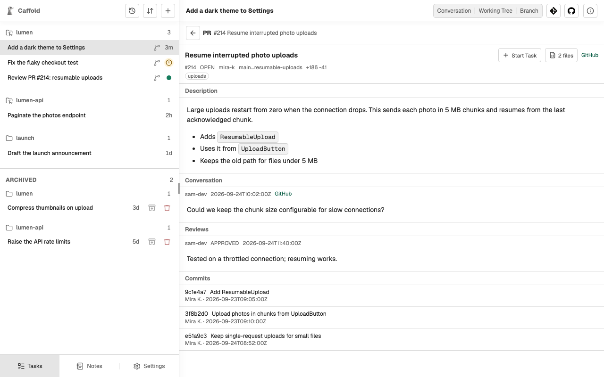

# GitHub

The GitHub button, with the GitHub logo, at the top of a Task or a repository
Section shows the repository's Issues and Pull Requests, and can start a Task
from one of them. Caffold reads GitHub and does not post comments, reviews,
or Pull Requests.



## Set up

GitHub views use the [GitHub CLI](https://cli.github.com/) on the Mac, signed
in to your account:

```sh
brew install gh
gh auth login
```

Caffold finds the GitHub repository from the Task's or Section's Git remote.
Without the GitHub CLI, only the GitHub views are unavailable.

## Read Issues and Pull Requests

**Issues** and **Pull Requests** list the repository's Issues and Pull
Requests. An Issue shows its description. A Pull Request shows its
description, conversation, reviews, and commits, and its file count, such as
**2 files**, opens its changed files with their diffs.

The lists are read when you open them; they do not update on their own.

## Start a Task from an Issue or a Pull Request

**Start Task** creates a new Task for the Issue or Pull Request. It asks for a
model, and for an Issue also for the base branch to start from. The new Task
then:

1. names itself after the Issue or Pull Request;
2. prepares its own [worktree](../tasks/worktrees.md) with a new branch: from
   the base you chose for an Issue, or from the Pull Request's head;
3. stops, and waits for what you want done next.

Caffold tells the agent to read the Issue or Pull Request as information, not
as instructions. Tell the Task what to do, for example "Review this Pull
Request" or "Fix this Issue".
