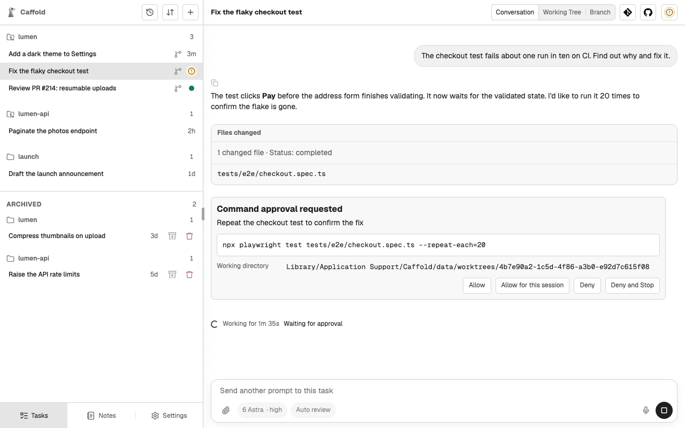
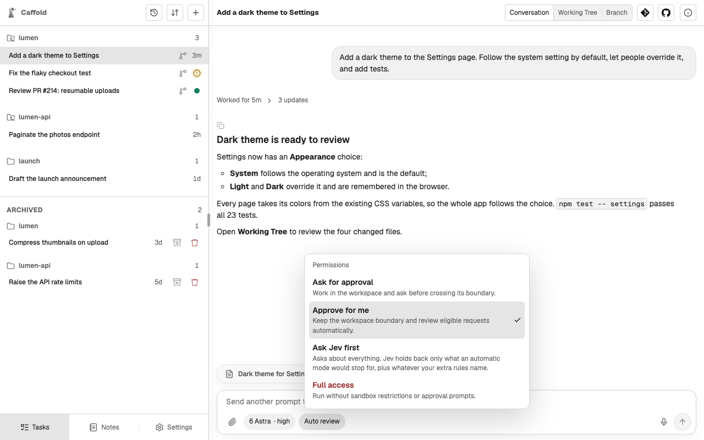

# Approvals

An agent asks before it does something its approval mode does not already
allow, such as running a command, reaching the network, or writing outside its
workspace. Caffold puts the request in the conversation and the turn waits for
your answer.

## Answer a request

The request shows what the agent wants to do, in the agent's words: the command
and the directory it runs in, the network destination, the access it asks for,
or the tool and its arguments, with the agent's reason. Choose one of the
answers it offers. Which answers appear depends on the agent and the kind of
request:

| Answer | What it does |
| --- | --- |
| **Allow** | Allows this request once. |
| **Allow for this session** | Codex: allows requests like this one for the rest of the session. |
| **Allow Always** | Allows it now and keeps the rule the agent proposed, so the agent stops asking. Grok keeps that rule for the working directory, shared by every Caffold Task there. |
| **Deny** | Refuses the request. Codex and Claude Code carry on without it; a Grok turn ends. |
| **Deny and Stop** | Refuses the request and stops the turn. |
| **Cancel** | Skips a Codex tool call without stopping the turn. |

A refused request reads as declined in the conversation. While a request is
waiting, the Task list shows the Task as waiting for approval, and a
[notification](../get-started/notifications.md) can tell you.

When an agent wants to ask you a question rather than ask for permission,
Caffold has it ask in the conversation. Answer it in the Composer like any
other message.

Caffold's own tools, which name the Task, prepare a worktree, and keep Notes,
run without an approval request.

## Approval modes

The approval mode decides how much the agent asks. The button beside the model
in the Composer shows the current mode, for example **Auto review**, and opens
the **Permissions** menu. Each agent offers its own modes, from asking before
most actions to never asking, and the menu lists the ones the chosen agent and
model offer, each with a short description. Modes that give up the protection
of asking are marked in red.

- The next turn always runs under the mode the Composer shows.
- In a Codex or Claude Code Task you can change the mode between turns.
- A Grok Task fixes its mode when its conversation starts. Its Composer shows
  the mode but cannot change it; start a new Task to use another mode.

Every agent's menu also offers **Ask Jev first**, a mode of Caffold's own in
which Jev answers the routine requests and leaves the rest to you. See
[Ask Jev first](ask-jev-first.md).
