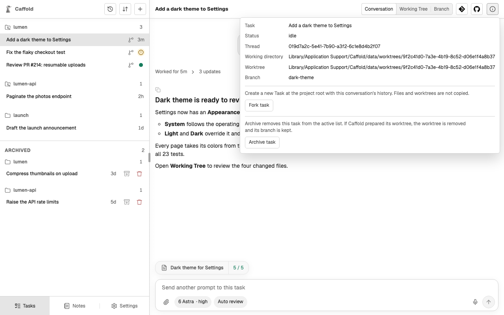

# Archive, restore, and delete

Archive a Task when you are done with it. Archived Tasks leave the active list
but can come back, and only an archived Task can be deleted.

## Archive

Open the Task, choose **Task details** at its top right, and choose
**Archive task**.

- A Task that is still running cannot be archived; stop or finish its turn
  first.
- If the Task runs in a [worktree](worktrees.md) Caffold prepared, the worktree
  must have no uncommitted changes, including new files Git does not ignore,
  such as [uploaded attachments](start-a-task.md#attach-files). Caffold then
  removes the worktree and keeps its branch.
- Caffold also asks the agent to archive or close its conversation. If the
  agent cannot be reached, the Task is archived anyway.

## Restore

Archived Tasks are listed under **Archived** at the bottom of the Task list.
The restore button on an archived Task's row returns it to the active list,
recreates its worktree from the kept branch, and reopens the same conversation.
Restore is available once the agent confirms that the conversation still
exists.

## Delete permanently

The delete button, a trash can on the same row, asks for confirmation, then
deletes the agent's conversation and Caffold's record of the Task. Your local
Git branch is kept. Deletion cannot be undone.
