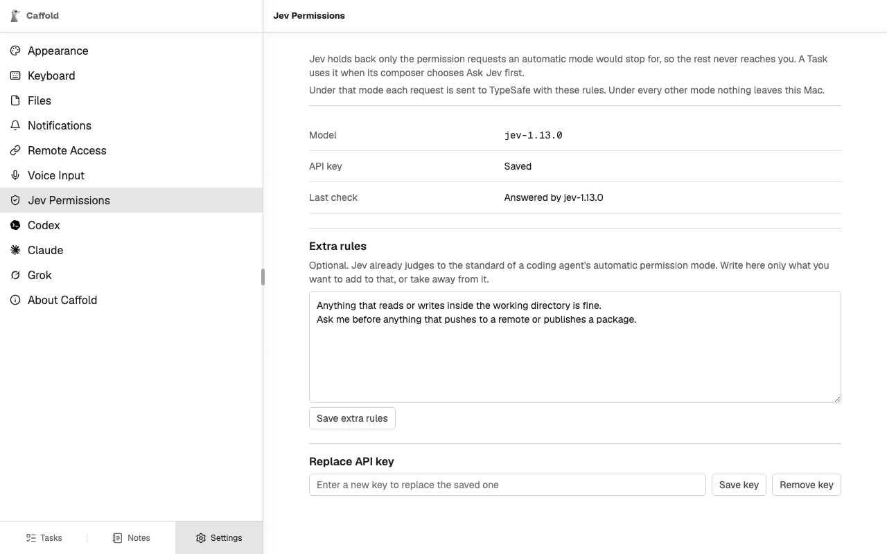
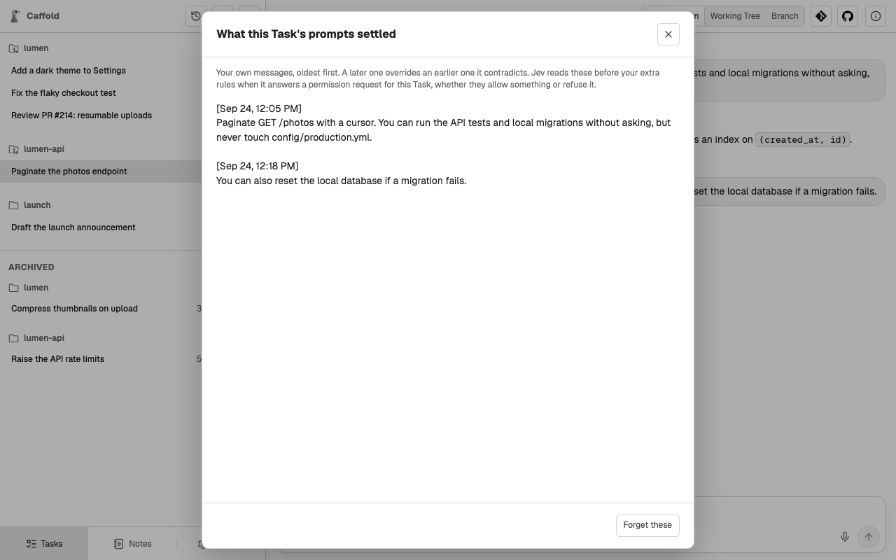

# Ask Jev first

**Ask Jev first** is an approval mode Caffold adds to every agent. The agent
asks about everything, and Jev, a decision model from
[TypeSafe](https://typesafe.ai), answers the routine requests for you. Only the
requests that need a person reach you.

## Set it up

1. Open **Settings → Jev Permissions**.
2. Enter your TypeSafe API key and choose **Save key**. Caffold asks Jev one
   test question and shows the answer under **Last check**.
3. Optionally, write **Extra rules** that add to Jev's baseline or take away
   from it, and choose **Save extra rules**.
4. In a Task's Composer, choose **Ask Jev first** in the **Permissions** menu.

Without a key, **Ask Jev first** stays in the menu and says what is missing.

## How it works

With **Ask Jev first**, the agent runs under whichever of its own modes asks
the most. Before a request is shown to you, Caffold asks Jev one question:
does this request need a person?

- If Jev finds no reason to ask you, Caffold allows the request once. The
  conversation records the request with Jev's answer.
- Otherwise the request comes to you as usual, and its card shows how sure Jev
  is, for example **80% sure this needs you**.

Jev never refuses a request and never grants anything beyond this one request.
If Jev cannot answer within five seconds, or the call fails for any reason,
the request comes to you exactly as it would without Jev.

## What Jev goes by

Jev's baseline is the standard of a coding agent's automatic permission mode.
Your own instructions override that baseline, strongest first:

1. the prompt that started the current turn;
2. what your prompts in this Task settled (see below);
3. the extra rules in **Settings → Jev Permissions**.

## What your prompts settled

While a Task's turns run under **Ask Jev first**, Jev also reads each prompt
you send there: does it say what the agent may or may not do in this Task? If
it does, the prompt is kept, word for word, in that Task's record, and Jev
takes it into account from then on. A later prompt overrides an earlier one it
contradicts.

To see the record, choose **Task details** at the top right of the Task, then
**What your prompts settled**, which appears while the Task uses
**Ask Jev first**. **Forget these** clears the record; this cannot be undone.

## What Jev sees

Choosing **Ask Jev first** sends information to TypeSafe:

- for each approval request: the request as the agent wrote it for you, with
  the agent's own title and reason; the Task's working directory; your extra
  rules; what your prompts in the Task settled; and the prompt that started
  the turn;
- for each prompt you send in the Task: the prompt, with what the Task's
  prompts settled so far.

Under every other approval mode, nothing is sent to TypeSafe. The key and the
rules are stored on the Mac; see
[Data and privacy](../reference/data-and-privacy.md).
