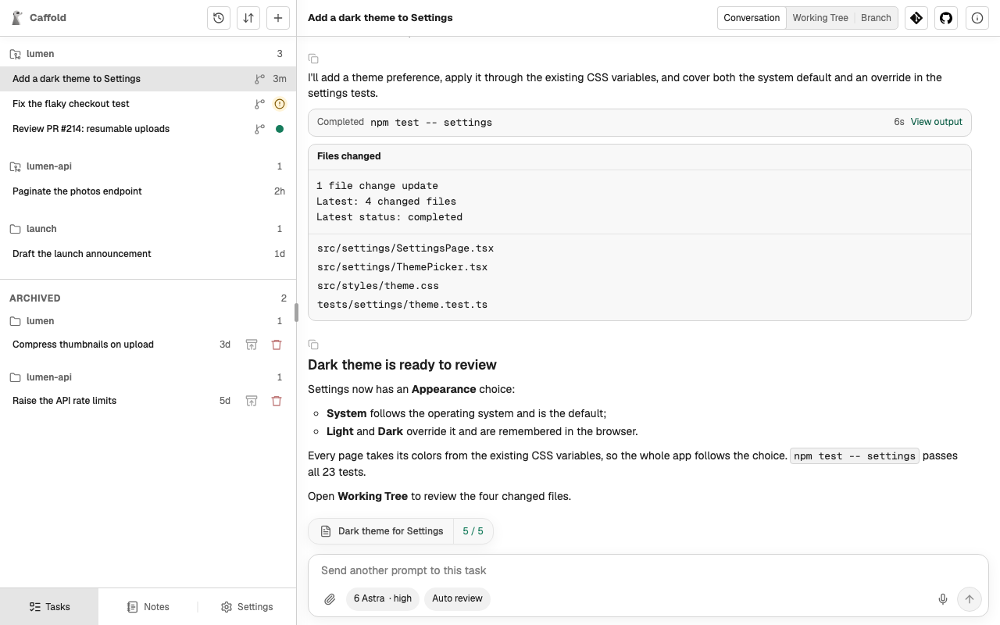

# Follow a conversation

A Task's **Conversation** shows the agent's conversation as it happens: your
prompts, the agent's messages, the work it does, and the approvals it asks
for.

## What the conversation shows

- **Your prompts**, as you sent them, with their
  [attached files](start-a-task.md#attach-files).
- **The agent's messages**, formatted as Markdown. While a turn runs, its
  progress messages appear as they arrive.
- **The work**: commands with their output, changed files, reasoning
  summaries, and tool calls. When a turn finishes, its work folds into one
  **Worked for** line with the number of updates; choose it to unfold the work.
- **Approval requests** and how each was answered. See
  [Approvals](approvals.md).
- **How each turn ended**: completed, interrupted, or failed, with the error
  the agent reported.

**View output** on a command opens its full output.

## Copy an answer

Every message from the agent has a **Copy message** button, which copies the
message as Markdown.

## Earlier history

Scroll to the top of the conversation, or choose **Load older messages**, to
load earlier turns.

## Coming back to a Task

The Task list shows where each Task stands:

- a spinner while a turn is running;
- an alert when the Task is waiting for your approval, a question mark when it
  is waiting for your answer, and a warning when its turn failed;
- a dot when a turn finished since you last opened the Task;
- otherwise, how long ago its last turn finished.

To be told when a turn ends or an approval is waiting, turn on
[Notifications](../get-started/notifications.md).
