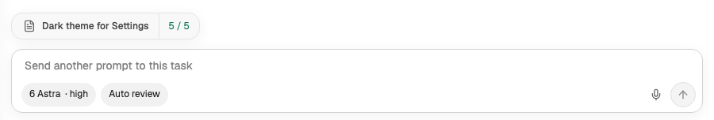
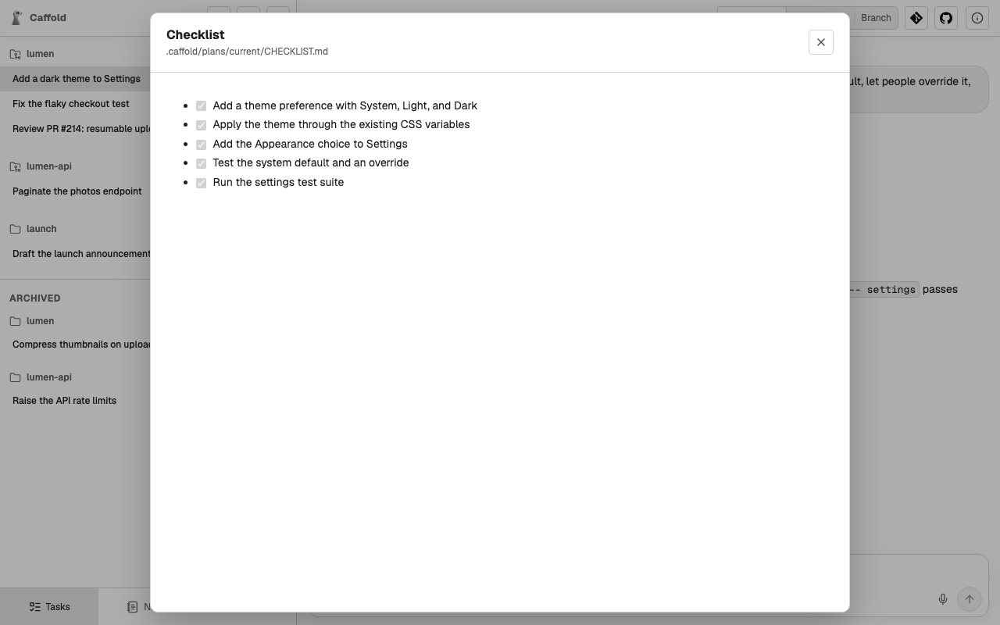

# Work from a plan

For longer work, an agent can keep a written plan in the Task's working
directory, and Caffold shows its progress above the Composer. It works the same
with every agent, and every agent is told about it, so you only have to ask for
a plan:

```text
Keep a current plan for this work.
```

## The two files

A current plan is two ordinary Markdown files, relative to the Task's working
directory:

```text
.caffold/plans/current/PLAN.md
.caffold/plans/current/CHECKLIST.md
```

- `PLAN.md` holds the plan in any form. Its first `#` heading is the plan's
  title.
- `CHECKLIST.md` holds a task list in any form. Every `- [ ]` and `- [x]` item
  in it counts toward the progress, wherever it sits in the file.

## Follow the progress

While both files are there, the Task shows the plan's title and a count such as
**3 / 5** above the Composer. The count updates as the agent edits the
checklist.



Choose the title to read `PLAN.md`, or the count to read `CHECKLIST.md`; the
checkboxes there are for reading only.



If one file is missing or cannot be read, the same place shows a warning, such
as `CHECKLIST.md missing`, instead of a count. Choose it to see the problem.

## When the plan is done

A finished checklist does not end the plan: it stays current while both files
exist. Ask the agent to move or delete them when you are done. Caffold never
moves, deletes, or edits them, and does not change `.gitignore` for them; if
they are ignored or untracked, they disappear with the worktree they are in.
