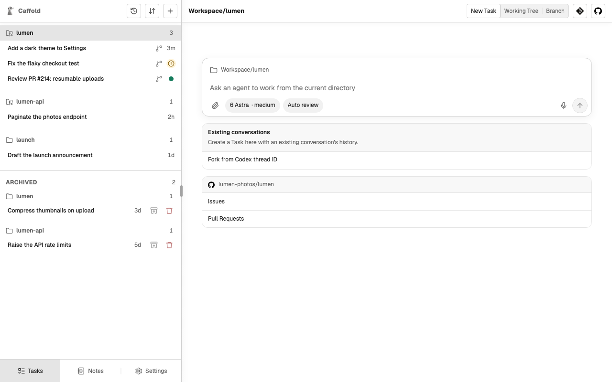

# Sections

The Task list groups your Tasks into Sections. A Section is a directory: the
first Task you start in a directory creates its Section, and later Tasks there
join it. A Section is listed for as long as it has active Tasks.

A Section whose directory is a Git repository shows a repository icon. Tasks
that move into a [worktree](worktrees.md) stay in their repository's Section,
marked with a branch icon.

## Open a Section

Select a Section's name to open it. An open Section offers, for its directory:

- **New Task**, which starts a Task there with the model, reasoning level,
  speed, and approval mode of the last turn started in that Section.
- For a repository, **Working Tree**, **Branch**, **Git**, and **GitHub**, which
  show the repository itself without opening a Task. See
  [Review changes](../review/changes.md).
- **Existing conversations**, which forks a Codex conversation into the
  Section. See [Fork a Codex conversation](fork.md).

## Reorder

Choose the reorder button at the top of the Task list, then choose whether to
move Tasks within their Sections or move whole Sections. Drag the rows into the
order you want; press <kbd>Esc</kbd> or choose the button again to finish. The
order is kept on the Mac, so every screen shows the same list.

The [Task Switcher](../keyboard.md#switch-tasks-t) lists the same
Tasks by when they last finished instead, without changing this order.
