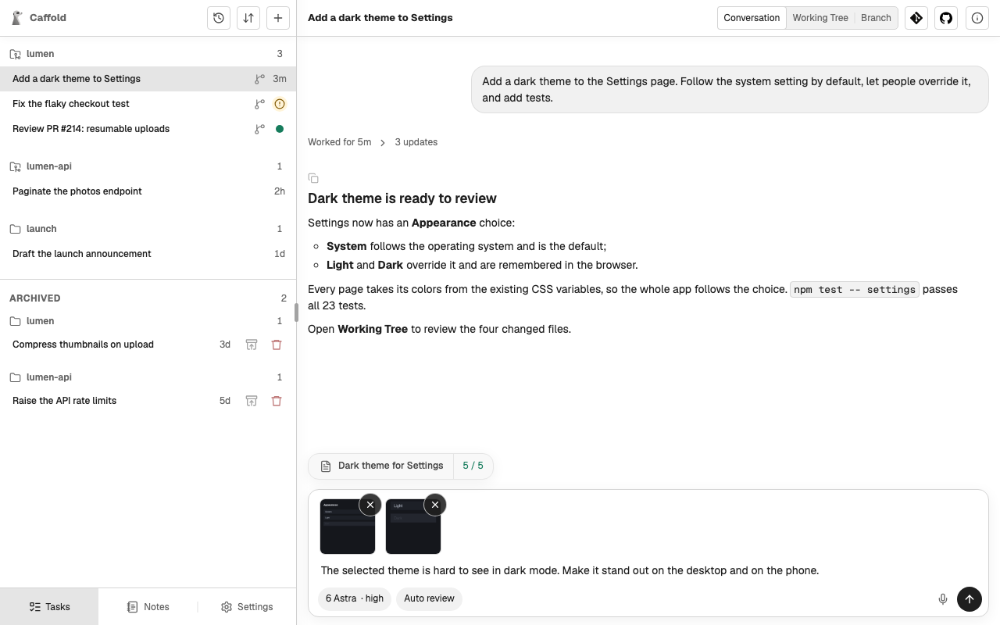

# Start a Task

A Task is one piece of work given to one agent. You start it with a directory,
a model, and a first prompt.

## Start from New Task

1. Choose **New Task** (+) at the top of the Task list.
2. Check the directory at the top of the Composer; the Task works there. To
   change it, choose **Browse Files**, pick a folder, and choose
   **Use This Folder**.
3. Open the model menu, which shows the current model. Under **Provider**,
   choose the agent, then choose one of its models under **Model**. When the
   model offers them, the same menu also sets the **Reasoning level** and
   **Speed**.
4. Choose an approval mode from the button beside it. See
   [Approvals](approvals.md).
5. Write the prompt and send it. You can [paste images](#add-images) into it,
   or [dictate it](../voice-input.md).

The Task opens right away with your message. Near the end of the first turn,
the agent names the Task after what you asked for. To rename it later, ask the
agent, for example `Rename this task to Dark theme`.

## Add images

Paste a screenshot or another image into the prompt. This works in every
Composer: New Task, a Task's next prompt, and a prompt you send into a running
turn.

Each image shows as a thumbnail above the prompt. Choose a thumbnail to see it
larger, or the X on it to take it out.

- Up to four images per prompt.
- PNG, JPEG, GIF, WebP, or AVIF, each up to 10 MB.

The images appear with your prompt in the conversation. Whether the agent reads
them depends on the model you chose.

## The model chooses the agent

Every model belongs to one agent: Codex, Claude Code, or Grok. The model you
choose for a new Task decides which agent runs it, and the Task keeps that
agent for its whole life. To work with another agent, start another Task.

Between turns you can still change the model, among the same agent's models,
and the reasoning level and speed the model offers. Whether the approval mode
can change depends on the agent; see [Approval modes](approvals.md#approval-modes).

## Other ways to start a Task

- **From a Section.** Select a Section in the Task list to start a Task in its
  directory with the choices last used there. See [Sections](sections.md).
- **From GitHub.** An Issue or a Pull Request can start a Task that prepares its
  own worktree. See [GitHub](../review/github.md).
- **From a Codex conversation.** Fork an existing Codex conversation into a new
  Task. See [Fork a Codex conversation](fork.md).
