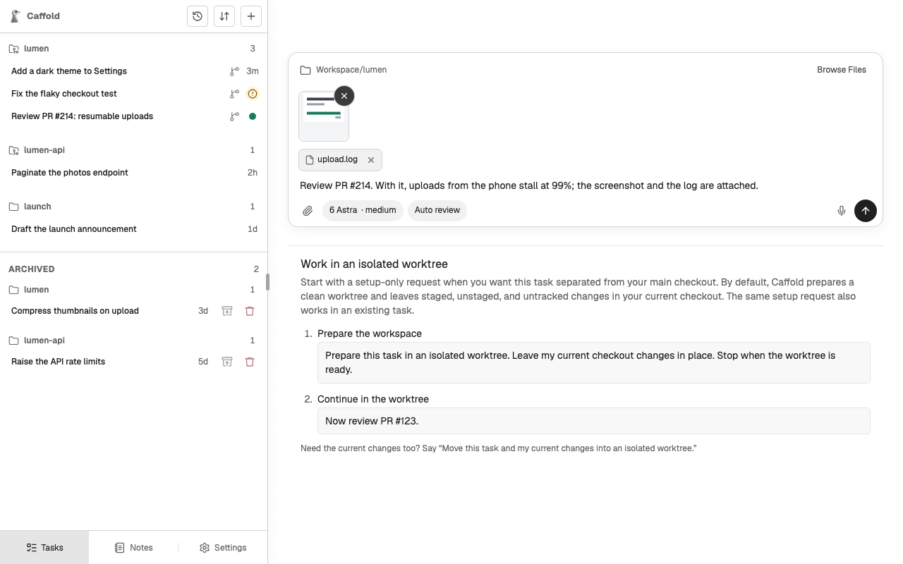
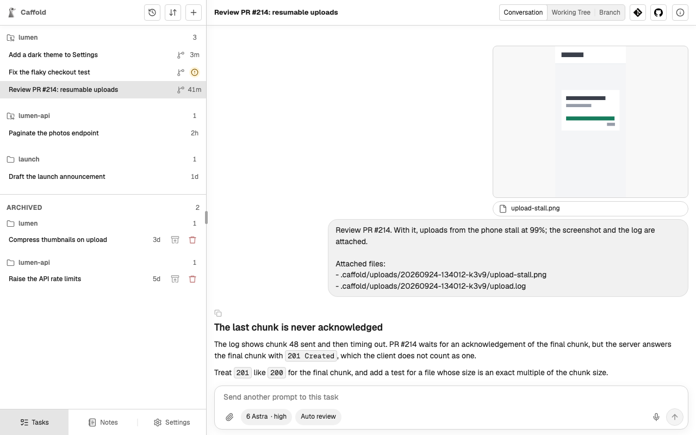

# Start a Task

A Task is one piece of work given to one agent. You start it with a directory,
a model, and a first prompt.

## Start from New Task

1. Choose **New Task** (+) at the top of the Task list.
2. Check the directory at the top of the Composer; the Task works there. To
   change it, choose **Browse Files**, pick a folder, and choose
   **Use This Folder**.
3. Open the model menu, which shows the current model. Under **Provider**,
   choose the agent, then choose one of its models under **Model**. When the
   model offers them, the same menu also sets the **Reasoning level** and
   **Speed**.
4. Choose an approval mode from the button beside it. See
   [Approvals](approvals.md).
5. Write the prompt and send it. You can [attach files](#attach-files) to it,
   or [dictate it](../voice-input.md).

The Task opens right away with your message. Near the end of the first turn,
the agent names the Task after what you asked for. To rename it later, ask the
agent, for example `Rename this task to Dark theme`.

## Attach files

Every Composer takes files: New Task, a Task's next prompt, and a prompt you
send into a running turn. Attach up to ten files of up to 100 MB each:

- choose **Attach files**, the paper clip, and pick them;
- paste files or screenshots into the prompt; or
- drop them on the Composer.

Folders cannot be attached. A picture shows as a thumbnail you can choose to
see larger, and any other file by its name; the X on each takes it out.

Sending uploads the files to the Mac one at a time, into a folder of their own
under `.caffold/uploads/` in the Task's working directory, and the message
shows the upload's progress. **Cancel upload** stops it and returns the prompt
to the Composer; during a running turn, that button is **Stop current turn** and
also stops the turn.

Once the files are up, the prompt reaches the agent with an **Attached files**
list of their paths, which the agent reads and the conversation shows.

A PNG, JPEG, GIF, WebP, or AVIF picture of up to 10 MB also reaches the agent
as an image; whether the agent reads it depends on the model you chose. Any
other file reaches the agent through its path.

Files the agent received stay in the working directory, and Caffold does not
change Git tracking for `.caffold/`. Unless the repository ignores
`.caffold/uploads/`, they show in [Working Tree](../review/changes.md) like any
new file, and in a Caffold worktree they keep the Task from being
[archived](archive-and-delete.md#archive) until you remove them.

## The model chooses the agent

Every model belongs to one agent: Codex, Claude Code, or Grok. The model you
choose for a new Task decides which agent runs it, and the Task keeps that
agent for its whole life. To work with another agent, start another Task.

Between turns you can still change the model, among the same agent's models,
and the reasoning level and speed the model offers. Whether the approval mode
can change depends on the agent; see [Approval modes](approvals.md#approval-modes).

## Other ways to start a Task

- **From a Section.** Select a Section in the Task list to start a Task in its
  directory with the choices last used there. See [Sections](sections.md).
- **From GitHub.** An Issue or a Pull Request can start a Task that prepares its
  own worktree. See [GitHub](../review/github.md).
- **From a Codex conversation.** Fork an existing Codex conversation into a new
  Task. See [Fork a Codex conversation](fork.md).
