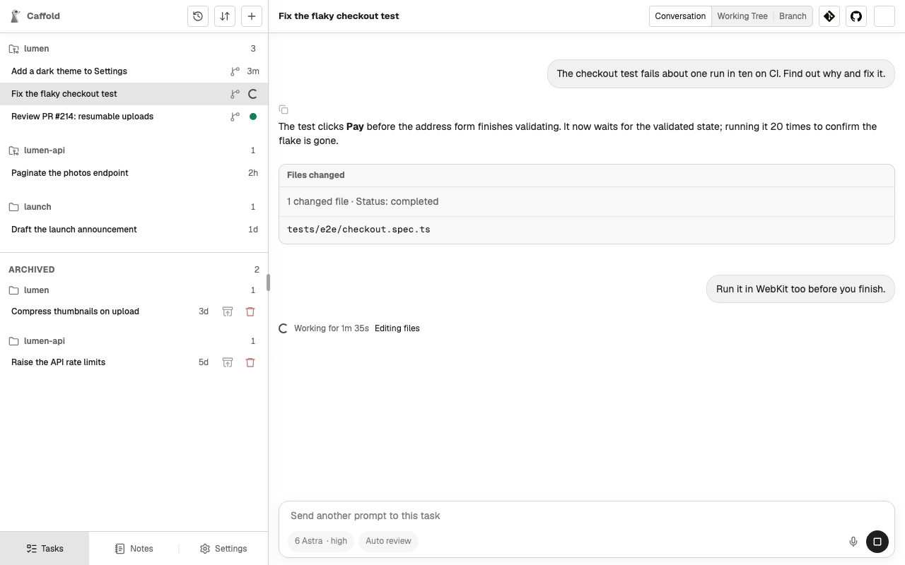

# Steer and stop

## Steer a running turn

You do not have to wait for a turn to finish. A prompt you send while the agent
is working goes into the running turn, and the agent takes it in as it works.

## Stop a turn

While a turn runs and the Composer is empty, the send button becomes
**Stop current turn**. Stopping keeps everything the agent already did.

Prompts you sent into the turn that the agent had not taken in yet come back
to the Composer with their [images](start-a-task.md#add-images), in the order
you sent them and ahead of anything you were typing, so you can send them again
or discard them.
