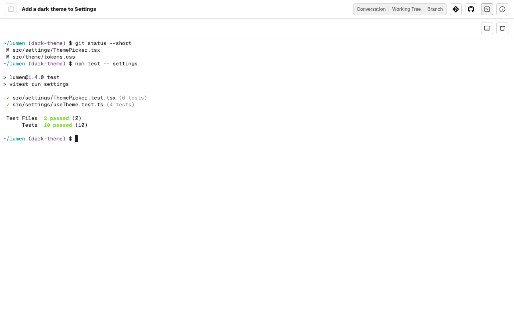
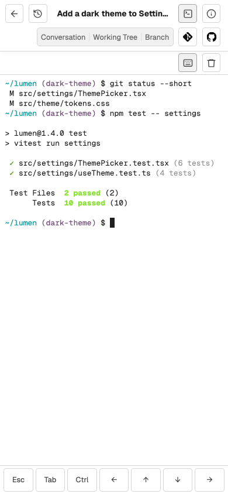

# Use the terminal

Each Task and each Section has a terminal: a shell on your Mac that starts in
the Task's working directory, or in the Section's directory. Use it to check
the agent's work yourself, run a command, or look around the files.

## Open and leave the terminal

Choose the terminal button in the Task's header, left of **Task details**, or
press <kbd>⌘</kbd>+<kbd>J</kbd> or <kbd>Ctrl</kbd>+<kbd>&#96;</kbd>. The
terminal takes the place of what the Task was showing and, on a wide screen, of
the Task list too, so it has the whole width. The first time, Caffold starts
your login shell.

Choose the button or press the key again to go back to where you were. On a
Section, the terminal button is the last one in the header.

Both keys work while you type and when keyboard navigation is off.
<kbd>Ctrl</kbd>+<kbd>&#96;</kbd> is for keyboards without <kbd>⌘</kbd>.

## Keep it running

The terminal keeps running on your Mac when you close the browser, change
Tasks, or put your phone away. Open it again, from the same device or another,
and it shows the same shell and screen, including what a running command
printed in the meantime.

A terminal shows on one screen at a time. Opening it on another device moves it
there, and the screen that had it says **This terminal is open on another
screen** with **Open here** to take it back. A page you reload or come back to
shows the terminal only while no other screen has it. The page's own
connection, lost while the network dropped or the device slept, does not count
as another screen.

## Type into it

Everything you type goes to the shell, including <kbd>Esc</kbd>, so programs
such as editors get it. Leave the terminal with <kbd>⌘</kbd>+<kbd>J</kbd> or
<kbd>Ctrl</kbd>+<kbd>&#96;</kbd>. To reach the buttons above the terminal from
the keyboard, press <kbd>⇧</kbd>+<kbd>⌘</kbd>+<kbd>F</kbd> or
<kbd>Ctrl</kbd>+<kbd>Shift</kbd>+<kbd>F</kbd> and type a code. To scroll back,
use the mouse wheel, touch, or <kbd>Shift</kbd>+<kbd>PageUp</kbd> and
<kbd>Shift</kbd>+<kbd>PageDown</kbd>; a terminal keeps its last 5,000 lines.

On a phone or tablet, a row of special keys sits under the terminal:
<kbd>Esc</kbd>, <kbd>Tab</kbd>, <kbd>Ctrl</kbd>, and the arrows. <kbd>Ctrl</kbd>
applies to the next key you press, so <kbd>Ctrl</kbd> and then <kbd>C</kbd>
stops a command. The keyboard button above the terminal shows or hides the row,
and each browser remembers your choice. While the on-screen keyboard is open,
the terminal ends above it, so the prompt and the special key row stay in
sight.

For more than one shell in a Task, run a program such as `tmux` inside the
terminal.

## Close it

Type `exit`, press <kbd>Ctrl</kbd>+<kbd>D</kbd>, or choose **Kill terminal**,
the trash button above the terminal. The screen goes back to where you were
before you opened the terminal. A terminal screen you reach with no terminal
running, by link or after Caffold Server restarted, offers **Open terminal** to
start a new one.

A terminal also closes when:

- its Task moves into a [worktree](worktrees.md), so a new one starts there;
- its Task is [archived](archive-and-delete.md#archive);
- Caffold Server stops or restarts; or
- more than 10 terminals are open. Caffold closes one that no screen shows,
  preferring one with no command running and the one you used longest ago.
