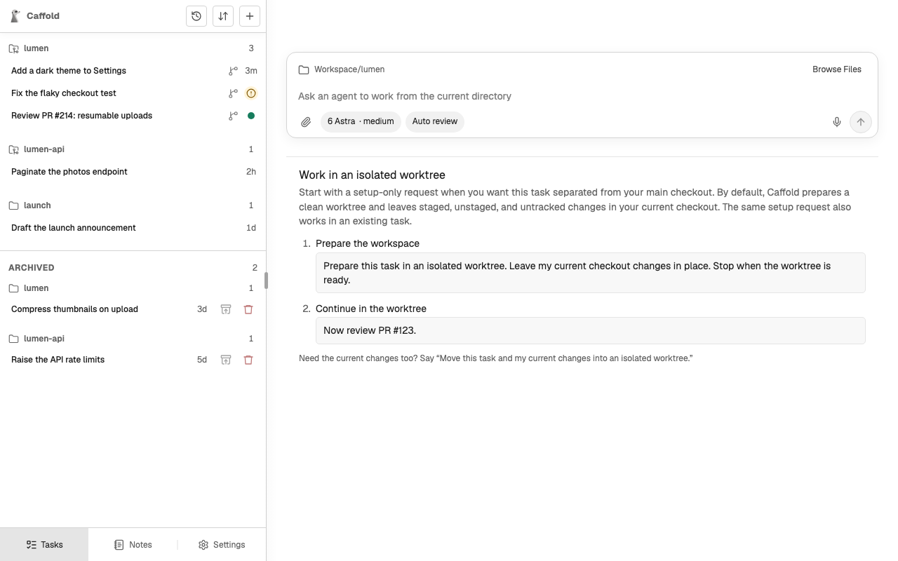

# Worktrees

A Task can move into a Git worktree of its own, so that its changes stay apart
from your main checkout and from other Tasks. Nothing moves automatically; you
ask the agent when separation is useful, and the same Task and conversation
continue in the worktree.

## Move a Task into a worktree

Ask the agent in the Task, for example:

```text
Prepare this task in an isolated worktree. Leave my current checkout changes in place. Stop when the worktree is ready.
```

The agent prepares the worktree with a tool Caffold gives it, and the turn ends
there. Your next prompt runs in the worktree:

```text
Now review PR #123.
```

New Task shows these two prompts as a guide. You can send the first one as the
first prompt of a new Task, or later in an existing one.



In the Task list, a branch icon marks a Task that runs in a worktree Caffold
prepared. Caffold keeps these worktrees under
`~/Library/Application Support/Caffold/data/worktrees`.

## Bring your uncommitted changes

By default, staged, unstaged, and untracked changes stay in your checkout. To
take them along, say so:

```text
Move this task and my current changes into an isolated worktree.
```

Ignored files and build output stay where they are. An unfinished merge or
rebase, or changes inside a submodule, stop the move instead.

## Which branch the worktree uses

- If the checkout is on a branch other than the default one and has no
  changes, that branch moves to the worktree, and the checkout switches to the
  default branch.
- If the checkout is on the default branch or on a detached commit, the
  worktree gets a new branch named `caffold/<task-name>-<id>`, unless you ask
  for a name.
- A branch with uncommitted changes can move only together with those changes,
  because Git cannot check out one branch in two places. Ask to bring the
  changes, or commit them first.

## Clean up

Archiving a Task removes the worktree Caffold prepared for it and keeps its
branch; see [Archive, restore, and delete](archive-and-delete.md). Caffold
never removes a worktree it did not prepare, and never deletes a branch.
