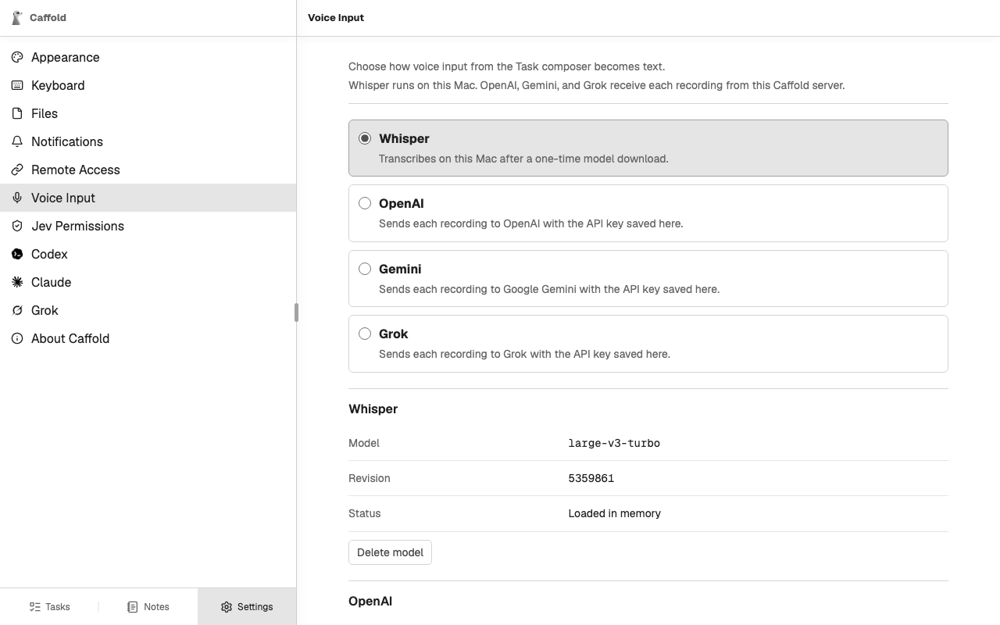

# Voice input

You can dictate a prompt instead of typing it, in any language the chosen
provider understands. Voice input works in every Composer: New Task and each
Task's follow-up prompt.

## Choose how speech becomes text

Open **Settings → Voice Input** and choose a provider:

- **Whisper** transcribes on the Mac. Choose **Download** to fetch its model,
  about 1.5 GiB. The download continues on the Mac after you close the page,
  and Caffold checks the model before using it. **Cancel download** stops a
  download in progress, and **Delete model** removes the model.
- **OpenAI**, **Gemini**, and **Grok** transcribe with your own API key from
  that provider. Enter it and choose **Save key**. The page then shows only
  whether a key is saved; **Remove key** deletes it.

Whisper is the provider until you choose another.

## Dictate a prompt

1. Choose **Start voice input** in the Composer and allow the microphone when
   the browser asks. A timer and a level meter show that it is recording.
2. Speak.
3. Finish in one of two ways:
   - **Stop recording** transcribes the recording into the prompt, where you
     can edit it before sending;
   - the send button, which becomes **Finish voice input and send** while
     recording, transcribes and sends in one step.

**Cancel voice input** discards the recording. When the chosen provider is not
ready, the voice button reads **Set up voice input** and opens
**Settings → Voice Input** instead.

## Where recordings go

The browser sends each recording to the Mac. With Whisper it stays there; with
OpenAI, Gemini, or Grok, the Mac forwards it to that provider. Caffold never
stores recordings. Remote devices use the same private address as the rest of
Caffold, so dictating from a phone needs nothing extra.
